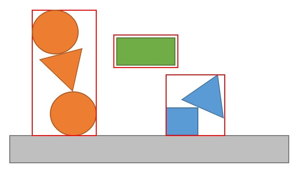
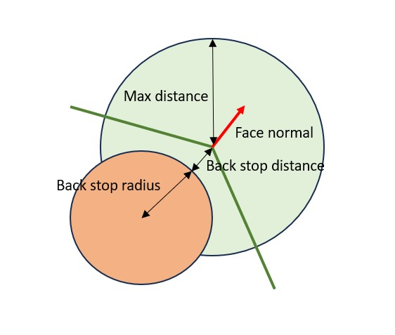
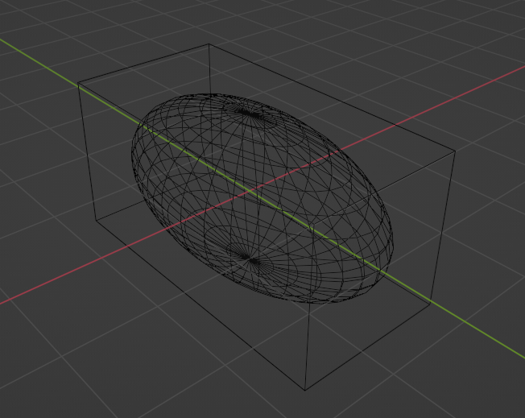
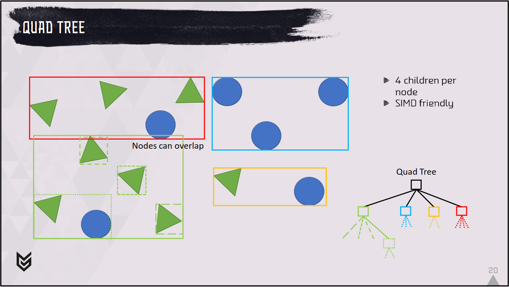
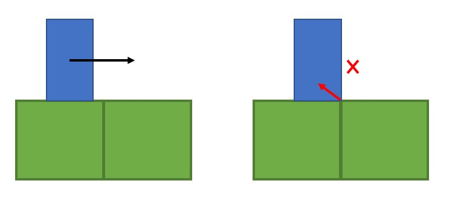
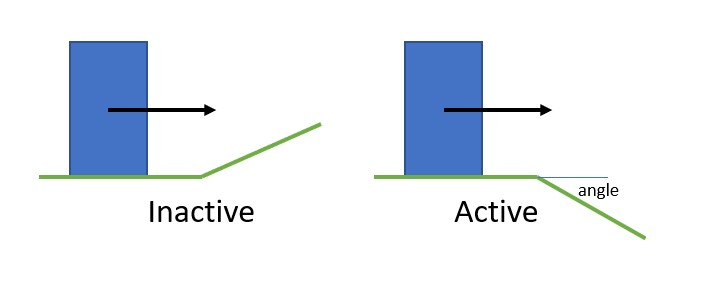
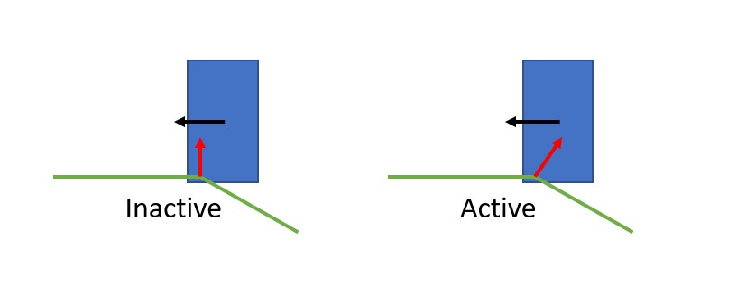

[TOC]

# Architecture of Jolt Physics {#architecture-jolt-physics}

# Getting Started {#getting-started}

To get started, look at the [HelloWorld](https://github.com/jrouwe/JoltPhysics/blob/master/HelloWorld/HelloWorld.cpp) example. A [HelloWorld example using CMake FetchContent](https://github.com/jrouwe/JoltPhysicsHelloWorld) is also available to show how you can integrate Jolt Physics in a CMake project.

Every feature in Jolt has its own sample. [Running the Samples application](Samples.md) and browsing through the [code](https://github.com/jrouwe/JoltPhysics/tree/master/Samples/Tests) is a great way to learn about the library!

The rest of this document describes the concepts used in Jolt in more detail.

# Bodies {#bodies}

We use a pretty traditional physics engine setup, so \ref Body "bodies" in our simulation are objects which have attached collision \ref Shape "shapes"

## Types {#body-types}

Bodies can either be:
- [static](@ref EMotionType) (not moving or simulating)
- [dynamic](@ref EMotionType) (moved by forces) or
- [kinematic](@ref EMotionType) (moved by velocities only).

Moving bodies have a [MotionProperties](@ref MotionProperties) object that contains information about the movement of the object. Static bodies do not have this to save space (but they can be configured to have it if a static body needs to become dynamic during its lifetime by setting [BodyCreationSettings::mAllowDynamicOrKinematic](@ref BodyCreationSettings::mAllowDynamicOrKinematic)).

## Creating Bodies {#creating-bodies}

Bodies are inserted into the [PhysicsSystem](@ref PhysicsSystem) and interacted with through the [BodyInterface](@ref BodyInterface).

The general life cycle of a body is:

- BodyInterface::CreateBody - Construct a Body object and initialize it. You cannot use `new` to create a Body.
- BodyInterface::AddBody - Add the body to the PhysicsSystem and make it participate in the simulation.
- BodyInterface::RemoveBody - Remove it from the PhysicsSystem.
- BodyInterface::DestroyBody - Deinitialize and destruct the Body. You cannot use `delete` to delete a Body. This function will not automatically remove the Body from the PhysicsSystem.

If you need to add many bodies at the same time then use the batching functions:

- BodyInterface::AddBodiesPrepare - Prepares bodies to be added to the PhysicsSystem. Doesn't affect simulation and can be done from a background thread.
- BodyInterface::AddBodiesFinalize - Finalize insertion. This atomically adds all bodies to the PhysicsSystem.
- BodyInterface::AddBodiesAbort - If you've called AddBodiesPrepare but changed your mind and no longer want to add the bodies to the PhysicsSystem. Useful when streaming in level sections and the player decides to go the other way.
- BodyInterface::RemoveBodies - Batch remove a lot of bodies from the PhysicsSystem.

Always use the batch adding functions when possible! Adding many bodies, one at a time, results in a really inefficient broadphase and in the worst case can lead to missed collisions (an assert will trigger if this is the case). If you cannot avoid adding many bodies one at a time, use PhysicsSystem::OptimizeBroadPhase to rebuild the tree.

You can call AddBody, RemoveBody, AddBody, RemoveBody to temporarily remove and later reinsert a body into the simulation.

## Multithreaded Access

Jolt is designed to be accessed from multiple threads so the body interface comes in two flavors: A locking and a non-locking variant. The locking variant uses a mutex array (a fixed size array of mutexes, bodies are associated with a mutex through hashing and multiple bodies use the same mutex, see [MutexArray](@ref MutexArray)) to prevent concurrent access to the same body. The non-locking variant doesn't use mutexes, so requires the user to be careful.

In general, body ID's ([BodyID](@ref BodyID)) are used to refer to bodies. You can access a body through the following construct:

	JPH::BodyLockInterface lock_interface = physics_system.GetBodyLockInterface(); // Or GetBodyLockInterfaceNoLock
	JPH::BodyID body_id = ...; // Obtain ID to body

	// Scoped lock
	{
		JPH::BodyLockRead lock(lock_interface, body_id);
		if (lock.Succeeded()) // body_id may no longer be valid
		{
			const JPH::Body &body = lock.GetBody();

			// Do something with body
			...
		}
	}

When another thread has removed the body between the time the body ID was obtained and the lock, the lock will fail. While the lock is taken, other threads cannot modify the body, so it is safe to work with it. Each body ID contains a sequence number, so body ID's will only be reused after many add/remove cycles. To write to a body use [BodyLockWrite](@ref BodyLockWrite).

You cannot use BodyLockRead to lock multiple bodies (if two threads lock the same bodies in opposite order you'll get a deadlock). Use [BodyLockMultiRead](@ref BodyLockMultiRead) or [BodyLockMultiWrite](@ref BodyLockMultiWrite) to lock them in a consistent order.

Note that a lot of convenience functions are exposed through the BodyInterface, but not all functionality is available, so you may need to lock the body to get the pointer and then call the function directly on the body.

## Single Threaded Access {#single-threaded-access}

If you're only accessing the physics system from a single thread, you can use Body pointers instead of BodyID's. In this case you can also use the non-locking variant of the body interface.

Note that there are still some restrictions:

* You cannot read from / write to bodies or constraints while PhysicsSystem::Update is running. As soon as the Update starts, all body / constraint mutexes are locked.
* Collision callbacks (see ContactListener) are called from within the PhysicsSystem::Update call from multiple threads. You can only read the body data during a callback.
* Activation callbacks (see BodyActivationListener) are called in the same way. Again you should only read the body during the callback and not make any modifications.
* Step callbacks (see PhysicsStepListener) are also called from PhysicsSystem::Update from multiple threads. You're responsible for making sure that there are no race conditions. In a step listener you can read/write bodies or constraints but you cannot add/remove them.

If you are accessing the physics system from multiple threads, you should probably use BodyID's and the locking variant of the body interface. It is however still possible to use Body pointers if you're really careful. E.g. if there is a clear owner of a Body and you ensure that this owner does not read/write state during PhysicsSystem::Update or while other threads are reading the Body there will not be any race conditions.

## Shapes {#shapes}

Each body has a shape attached that determines the collision volume. The following shapes are available (in order of computational complexity):

* [SphereShape](@ref SphereShape) - A sphere centered around zero.
* [BoxShape](@ref BoxShape) - A box centered around zero.
* [CapsuleShape](@ref CapsuleShape) - A capsule centered around zero.
* [TaperedCapsuleShape](@ref TaperedCapsuleShape) - A capsule with different radii at the bottom and top.
* [CylinderShape](@ref CylinderShape) - A cylinder shape. Note that cylinders are the least stable of all shapes, so use another shape if possible.
* [TaperedCylinderShape](@ref TaperedCylinderShape) - A cylinder with different radii at the bottom and top. Note that cylinders are the least stable of all shapes, so use another shape if possible.
* [ConvexHullShape](@ref ConvexHullShape) - A convex hull defined by a set of points.
* [TriangleShape](@ref TriangleShape) - A single triangle. Use a MeshShape if you have multiple triangles.
* [PlaneShape](@ref PlaneShape) - An infinite plane. Negative half space is considered solid.
* [StaticCompoundShape](@ref StaticCompoundShape) - A shape containing other shapes. This shape is constructed once and cannot be changed afterwards. Child shapes are organized in a tree to speed up collision detection.
* [MutableCompoundShape](@ref MutableCompoundShape) - A shape containing other shapes. This shape can be constructed/changed at runtime and trades construction time for runtime performance. Child shapes are organized in a list to make modification easy.
* [MeshShape](@ref MeshShape) - A shape consisting of triangles. They are mostly used for static geometry.
* [HeightFieldShape](@ref HeightFieldShape) - A shape consisting of NxN points that define the height at each point, very suitable for representing hilly terrain. Any body that uses this shape needs to be static.
* [EmptyShape](@ref EmptyShape) - A shape that collides with nothing and that can be used as a placeholder or for dummy bodies.

Next to this there are a number of decorator shapes that change the behavior of their children:

* [ScaledShape](@ref ScaledShape) - This shape can scale a child shape. Note that if a shape is rotated first and then scaled, you can introduce shearing which is not supported by the library.
* [RotatedTranslatedShape](@ref RotatedTranslatedShape) - This shape can rotate and translate a child shape, it can e.g. be used to offset a sphere from the origin.
* [OffsetCenterOfMassShape](@ref OffsetCenterOfMassShape) - This shape does not change its child shape but it does shift the calculated center of mass for that shape. It allows you to e.g. shift the center of mass of a vehicle down to improve its handling.

### Dynamic Mesh Shapes {#dynamic-mesh-shapes}

Meshes are usually static, but they can be made kinematic or dynamic provided that they don't collide with other mesh- or heightfield shapes (an assert will trigger when this happens and the collision will be ignored).

Mesh shapes also cannot calculate their mass and inertia, so when you want a dynamic mesh, you need to provide these yourself by setting BodyCreationSettings::mOverrideMassProperties = EOverrideMassProperties::MassAndInertiaProvided and supplying the mass and inertia in BodyCreationSettings::mMassPropertiesOverride.

An example can be found [here](https://github.com/jrouwe/JoltPhysics/blob/master/Samples/Tests/General/DynamicMeshTest.cpp).

Note that you should try to avoid dynamic mesh shapes as they are fairly expensive to simulate. Also, mesh shapes don't have a clear inside/outside so a mesh is only considered to be colliding when one of its triangles intersect with the other object. This can result in objects getting stuck inside the mesh without knowing which way is out.

### Creating Shapes {#creating-shapes}

Simple shapes like spheres and boxes can be constructed immediately by simply new-ing them. Other shapes need to be converted into an optimized format in order to be usable in the physics simulation. The uncooked data is usually stored in a [ShapeSettings](@ref ShapeSettings) object and then converted to cooked format by a [Create](@ref ShapeSettings::Create) function that returns a [Result](@ref Result) object that indicates success or failure and provides the cooked object.

Creating a convex hull for example looks like:

	// Shapes are refcounted and can be shared between bodies
	JPH::Ref<Shape> shape;

	// The ShapeSettings object is only required for building the shape, all information is copied into the Shape class
	{
		// Create an array of vertices
		JPH::Array<JPH::Vec3> vertices = { ... };

		// Create the settings object for a convex hull
		JPH::ConvexHullShapeSettings settings(vertices, JPH::cDefaultConvexRadius);

		// Create shape
		JPH::Shape::ShapeResult result = settings.Create();
		if (result.IsValid())
			shape = result.Get();
		else
			... // Error handling
	}

Note that after you call Create, the shape is cached and ShapeSettings keeps a reference to your shape (see @ref memory-management). If you call Create again, the same shape will be returned regardless of what changed to the settings object (unless you call [ClearCachedResult](@ref ShapeSettings::ClearCachedResult) to clear the cache).

### Saving Shapes {#saving-shapes}

There are two ways of serializing data:

* The uncooked data can be serialized using the [ObjectStream](@ref ObjectStream) system (either in [binary](@ref ObjectStreamBinaryOut) or in [text](@ref ObjectStreamTextOut) format), data stored in this way is likely to be compatible with future versions of the library (although there is no 100% guarantee of this).
* The cooked data can be serialized using the [SaveBinaryState](@ref Shape::SaveBinaryState) interface that various objects provide. Data stored in this way is optimized for simulation performance and loading speed but is very likely to change between versions of the library, so this should never be your primary data format.

An example of saving a shape in binary format:

	// Create a sphere of radius 1
	JPH::Ref<Shape> sphere = new JPH::SphereShape(1.0f);

	// For this example we'll be saving the shape in a STL string stream, but if you implement StreamOut you don't have to use STL.
	// Note that this will be storing a binary string of bytes that can contain 0-bytes, it is not an ASCII string!
	stringstream data;
	JPH::StreamOutWrapper stream_out(data);

	// Save the shape (note this function handles CompoundShape too).
	// The maps are there to avoid saving the same shape twice (it will assign an ID to each shape the first time it encounters them).
	// If you don't want certain shapes to be saved, add them to the map and give them an ID.
	// You can save many shapes to the same stream by repeatedly calling SaveWithChildren on different shapes.
	JPH::Shape::ShapeToIDMap shape_to_id;
	JPH::Shape::MaterialToIDMap material_to_id;
	sphere->SaveWithChildren(stream_out, shape_to_id, material_to_id);

	// Wrap the STL stream in a StreamIn
	JPH::StreamInWrapper stream_in(data);

	// Load the shape
	// If you have assigned custom ID's on save, you need to ensure that the shapes exist in this map on restore too.
	JPH::Shape::IDToShapeMap id_to_shape;
	JPH::Shape::IDToMaterialMap id_to_material;
	JPH::Shape::ShapeResult result = JPH::Shape::sRestoreWithChildren(stream_in, id_to_shape, id_to_material);

	JPH::Ref<Shape> restored_shape;
	if (result.IsValid())
		restored_shape = result.Get();
	else
		... // Error handling

As the library does not offer an exporter from content creation packages and since most games will have their own content pipeline, we encourage you to store data in your own format, cook data while cooking the game data and store the result using the SaveBinaryState interface (and provide a way to force a re-cook when the library is updated).

A possible pattern for serializing binary data in your own engine could be:

* EngineBody at runtime creates a Body. Note that the prefix 'Engine' means that it's a class in your own engine.
* It links to an EngineShape, which wraps a Shape.
* EngineShape comes in different flavors, e.g. EngineMeshShape, EngineSphereShape etc.
* EngineMeshShape contains the uncompressed mesh data (in a format that's editable in your tools).
* When 'cooking' the game data:
  * Create a MeshShape.
  * Save it using Shape::SaveWithChildren in a binary blob that's associated with the EngineMeshShape (could be in an attribute that's an array of bytes).
  * Throw away the uncompressed mesh data.
* When loading the EngineMeshShape using your own serialization system, also restore the MeshShape from the binary blob using Shape::sRestoreWithChildren.
* Your serialization system should take care that the pointer between EngineBody and EngineShape is restored.
* There are some tricks for sharing Shapes, e.g. an EngineCompoundShape links to multiple child EngineShapes:
  * At cooking time create a StaticCompoundShape.
  * Before writing the shape to the binary blob with Shape::SaveWithChildren it inserts all leaf shapes (the Shape associated with the child EngineShape) in the Shape::ShapeToIDMap so they won't be included in the binary blob.
  * Before loading the binary blob with Shape::sRestoreWithChildren prepopulate the Shape::IDToShapeMap with the pointers to the restored Shape's from the child EngineShapes (this again assumes that your own serialization system is capable of restoring the pointers between EngineCompoundShape and the child EntityShapes).

### Convex Radius {#convex-radius}

In order to speed up the collision detection system, all convex shapes use a convex radius. The provided shape will first be shrunken by the convex radius and then inflated again by the same amount, resulting in a rounded off shape:


### Center of Mass {#center-of-mass}

__Beware: When a shape is created, it will automatically recenter itself around its center of mass.__ The center of mass can be obtained by calling [Shape::GetCenterOfMass](@ref Shape::GetCenterOfMass) and most functions operate in this Center of Mass (COM) space. Some functions work in the original space the shape was created in, they usually have World Space (WS) or Shape Space (SS) in their name (or documentation).


As an example, say we create a box and then translate it:

	// Create box of 2x2x2 m (you specify half the side)
	JPH::BoxShapeSettings box(JPH::Vec3(1, 1, 1));
	JPH::Ref<Shape> box_shape = box.Create().Get();

	// Offset it by 10 m
	JPH::RotatedTranslatedShapeSettings translated_box(JPH::Vec3(10, 0, 0), JPH::Quat::sIdentity(), box_shape);
	JPH::Ref<Shape> translated_box_shape = translated_box.Create().Get();

	// Cast a ray against the offset box (WRONG!)
	JPH::RayCast ray;
	ray.mOrigin = JPH::Vec3(10, 2, 0);
	ray.mDirection = JPH::Vec3(0, -2, 0);

	// Cast ray
	JPH::RayCastResult hit;
	bool had_hit = translated_box_shape->CastRay(ray, JPH::SubShapeIDCreator(), hit);
	JPH_ASSERT(!had_hit); // There's no hit because we did not correct for COM!

	// Convert the ray to center of mass space for the shape (CORRECT!)
	ray.mOrigin -= translated_box_shape->GetCenterOfMass();

	// Cast ray
	had_hit = translated_box_shape->CastRay(ray, JPH::SubShapeIDCreator(), hit);
	JPH_ASSERT(had_hit); // Ray was in COM space, now there's a hit!

In the same way calling:

	translated_box_shape->GetLocalBounds();

will return a box of size 2x2x2 centered around the origin, so in order to get it back to the space in which it was originally created you need to offset the bounding box:

	JPH::AABox shape_bounds = translated_box_shape->GetLocalBounds();
	shape_bounds.Translate(translated_box_shape->GetCenterOfMass());
	JPH_ASSERT(shape_bounds == JPH::AABox(JPH::Vec3(9, -1, -1), JPH::Vec3(11, 1, 1))); // Now we have the box relative to how we created it

Note that when you work with interface of [BroadPhaseQuery](@ref BroadPhaseQuery), [NarrowPhaseQuery](@ref NarrowPhaseQuery) or [TransformedShape](@ref TransformedShape) this transformation is done for you.

### Scaling Shapes {#scaling-shapes}

Shapes can be scaled using the [ScaledShape](@ref ScaledShape) class. You can scale a shape like:

	JPH::RefConst<Shape> my_scaled_shape = new JPH::ScaledShape(my_non_scaled_shape, JPH::Vec3(x_scale, y_scale, z_scale));

Not all scales are valid for every shape. Use Shape::IsValidScale to check if a scale is valid for a particular shape (the documentation for this function also lists the rules for all shape types).

A safer way of scaling shapes is provided by the Shape::ScaleShape function:

	JPH::Shape::ShapeResult my_scaled_shape = my_non_scaled_shape->ScaleShape(JPH::Vec3(x_scale, y_scale, z_scale));

This function will check if a scale is valid for a particular shape and if a scale is not valid, it will produce the closest scale that is valid.
For example, if you scale a CompoundShape that has rotated sub shapes, a non-uniform scale would cause shearing. In that case the Shape::ScaleShape function will create a new compound shape and scale the sub shapes (losing the shear) rather than creating a ScaledShape around the entire CompoundShape.

Updating scaling after a body is created is also possible, but should be done with care. Imagine a sphere in a pipe, scaling the sphere so that it becomes bigger than the pipe creates an impossible situation as there is no way to resolve the collision anymore.
Please take a look at the [DynamicScaledShape](https://github.com/jrouwe/JoltPhysics/blob/master/Samples/Tests/ScaledShapes/DynamicScaledShape.cpp) demo. The reason that no ScaledShape::SetScale function exists is to ensure thread safety when collision queries are being executed while shapes are modified.

Note that there are many functions that take a scale in Jolt (e.g. CollisionDispatch::sCollideShapeVsShape), usually the shape is scaled relative to its center of mass. The Shape::ScaleShape function scales the shape relative to the origin of the shape.

### Creating Custom Shapes {#creating-custom-shapes}

If the defined Shape classes are not sufficient, or if your application can make a more efficient implementation because it has specific domain knowledge, it is possible to create a custom collision shape:

* Derive a new class from Shape (e.g. MyShape). If your shape is convex you can consider deriving from ConvexShape, if it contains multiple sub shapes you can derive from CompoundShape or if it wraps a single other shape it can be derived from DecoratedShape.
* Create a settings class that configures your shape (e.g. MyShapeSettings) and inherit it from the corresponding settings class (e.g. ShapeSettings, CompoundShapeSettings or DecoratedShapeSettings).
* Override the ```MyShapeSettings::Create``` function to construct an instance of MyShape.
* If you want to serialize the settings class, register it with the factory: ```Factory::sInstance->Register(RTTI_OF(MyShapeSettings))```
* If you inherited from Shape you need to select a shape type, use e.g. ```EShapeType::User1```
* In all cases you will need to specify a sub shape type, use e.g. ```EShapeSubType::User1```
* If you inherited from ConvexShape you can also specify a convex sub shape type, e.g. ```EShapeSubType::UserConvex1```, in which case you don't need to implement or register the collision detection functions mentioned below.
* Implement the virtual functions that your selected base class exposes. Some functions could be implemented as a dummy if you don't care about the functionality, e.g. if you don't care about buoyancy then GetSubmergedVolume does not need to be implemented.
* Create a ```MyShape::sRegister()``` function to register all collision functions, make sure you call this function after calling ```RegisterTypes()```, see [MeshShape::sRegister](@ref MeshShape::sRegister) for an example.
* Now write collision detection functions to test collision with all other shape types that this shape could collide with and register them with [CollisionDispatch::sRegisterCollideShape](@ref CollisionDispatch::sRegisterCollideShape) and [CollisionDispatch::sRegisterCastShape](@ref CollisionDispatch::sRegisterCastShape). This can be a lot of work, but there are some helper functions that you can use to reduce the work:
 * If you have implemented a collision test for type A vs B then you can register [CollisionDispatch::sReversedCastShape](@ref CollisionDispatch::sReversedCastShape) and [CollisionDispatch::sReversedCollideShape](@ref CollisionDispatch::sReversedCollideShape) for B vs A.
 * If your shape is triangle based, you can forward the testing of a shape vs a single triangle to the [CollideConvexVsTriangles](@ref CollideConvexVsTriangles) and [CastConvexVsTriangles](@ref CastConvexVsTriangles) classes.
 * If your shape contains sub shapes and you have determined that the shape intersects with one of the sub shapes you can forward the sub shape to the collision dispatch again through [CollisionDispatch::sCollideShapeVsShape](@ref CollisionDispatch::sCollideShapeVsShape) and [CollisionDispatch::sCastShapeVsShapeLocalSpace](@ref CollisionDispatch::sCastShapeVsShapeLocalSpace).

## Sensors {#sensors}

Sensors are normal rigid bodies that report contacts with other Dynamic or Kinematic bodies through the [ContactListener](@ref ContactListener) interface. Any detected penetrations will however not be resolved. Sensors can be used to implement triggers that detect when an object enters their area.

The cheapest sensor has a Static motion type. This type of sensor will only detect active bodies entering their area. As soon as a body goes to sleep, the contact will be lost. Note that you can still move a Static sensor around using [BodyInterface::SetPosition](@ref BodyInterface::SetPosition).

When you make a sensor Kinematic or Dynamic and activate it, it will also detect collisions with sleeping bodies, albeit with a higher run-time cost.

To create a sensor, either set [BodyCreationSettings::mIsSensor](@ref BodyCreationSettings::mIsSensor) to true when constructing a body or set it after construction through [Body::SetIsSensor](@ref Body::SetIsSensor). A sensor can only use the discrete motion quality type at this moment.

To make sensors detect collisions with static objects, set the [BodyCreationSettings::mCollideKinematicVsNonDynamic](@ref BodyCreationSettings::mCollideKinematicVsNonDynamic) to true or call [Body::SetCollideKinematicVsNonDynamic](@ref Body::SetCollideKinematicVsNonDynamic). Note that it can place a large burden on the collision detection system if you have a large sensor intersect with e.g. a large mesh terrain or a height field as you will get many contact callbacks and these contacts will take up a lot of space in the contact cache. Ensure that your sensor is in an object layer that collides with as few static bodies as possible.

To temporarily disable a sensor, choose between:

* Remove the sensor by calling BodyInterface::RemoveBody and re-add it later again with BodyInterface::AddBody.
* Change the collision layer using BodyInterface::SetObjectLayer to a layer that doesn't collide with anything (possibly also in a BroadPhaseLayer that doesn't collide with anything)

## Sleeping {#sleeping-bodies}

During the simulation step, bodies are divided in 'islands'. Each island consists of a set of dynamic bodies that are either in contact with each other, or that are connected through a constraint:



At the end of each step, all the bodies in an island are checked to see if they have come to rest, if this is the case then the entire island is put to sleep. When a body is sleeping, it can still detect collisions with other objects that are not sleeping, but it will not move or otherwise participate in the simulation to conserve CPU cycles. Sleeping bodies wake up automatically when they're in contact with non-sleeping objects or they can be explicitly woken through an API call like BodyInterface::ActivateBody. Unlike some other physics engines, removing a Body from the world doesn't wake up any surrounding bodies. If you want this you can call BodyInterface::ActivateBodiesInAABox with the bounding box of the removed body (or the combined bounding box if you're removing multiple bodies). Also, things like setting the velocity through Body::SetLinearVelocity will not wake up the Body, use BodyInterface::SetLinearVelocity instead. You can configure the definition of a body 'at rest' through PhysicsSettings::mTimeBeforeSleep and PhysicsSettings::mPointVelocitySleepThreshold.

## Soft Bodies {#soft-bodies}

Soft bodies (also known as deformable bodies) can be used to create e.g. a soft ball or a piece of cloth. They are created in a very similar way to normal rigid bodies:

* First allocate a new SoftBodySharedSettings object on the heap. This object will contain the initial positions of all particles and the constraints between the particles. This object can be shared between multiple soft bodies and should remain constant during its lifetime.
* Then create a SoftBodyCreationSettings object (e.g. on the stack) and fill in the desired properties of the soft body.
* Finally construct the body and add it to the world through BodyInterface::CreateAndAddSoftBody.

Soft bodies use the Body class just like rigid bodies but can be identified by checking Body::IsSoftBody. To get to the soft body state, cast the result of Body::GetMotionProperties to SoftBodyMotionProperties and use its API.

Soft bodies try to implement as much as possible of the normal Body interface, but this interface provides a simplified version of reality, e.g. Body::GetLinearVelocity will return the average particle speed and Body::GetPosition returns the average particle position. During simulation, a soft body will never update its rotation. Internally it stores particle velocities in local space, so if you rotate a soft body e.g. by calling BodyInterface::SetRotation, the body will rotate but its velocity will as well.

### Soft Body Contact Listeners {#soft-body-contact-listener}

Soft Bodies provide contacts with other bodies through the SoftBodyContactListener class. This contact listener works a little bit different from the normal contact listener as you will not receive a contact callback per colliding vertex.

After the broad phase has detected an overlap and the normal layer / collision group filters have had a chance to reject the collision, you will receive a SoftBodyContactListener::OnSoftBodyContactValidate callback. This callback allows you to specify how the vertices of the soft body should interact with the other body. You can override the mass for both bodies and you can turn the contact into a sensor contact.

The simulation will then proceed to do all collision detection and response and after that is finished, you will receive a SoftBodyContactListener::OnSoftBodyContactAdded callback that allows you to inspect all collisions that happened during the simulation step. In order to do this a SoftBodyManifold is provided which allows you to loop over the vertices and ask each vertex what it collided with.

Note that at the time of the callback, multiple threads are operating at the same time. The soft body is stable and can be safely read. The other body that is collided with is not stable however, so you cannot safely read its position/orientation and velocity as it may be modified by another soft body collision at the same time.

### Skinning Soft Bodies {#skinning-soft-bodies}

Using the [skinning](@ref SoftBodySharedSettings::Skinned) constraints, a soft body can be (partially) skinned to joints. This can be used e.g. to partially drive cloth with a character animation. The [vertices](@ref SoftBodySharedSettings::Vertex::mPosition) of the soft body need to be placed in the neutral pose of the character and the joints for this pose need to be calculated in model space (relative to these vertices). The inverted matrices of this neutral pose need to be stored as the [inverse bind matrices](@ref SoftBodySharedSettings::InvBind) and the skinning constraints can then be [weighted](@ref SoftBodySharedSettings::SkinWeight) to these joints. SoftBodySharedSettings::CalculateSkinnedConstraintNormals must be called to gather information needed to calculate the face normals at run-time.

At run-time, you need to provide the animated joints every simulation step through the SoftBodyMotionProperties::SkinVertices call. During simulation, each skinned vertex will calculate its position and this position will be used to limit the movement of its simulated counterpart.



The adjacent faces of the soft body will be used to calculate the normal of each vertex (shown in red), the vertex is then free to move inside the sphere formed by the skinned vertex position with radius [MaxDistance](@ref SoftBodySharedSettings::Skinned::mMaxDistance) (green sphere). To prevent the vertex from intersecting with the character, it is possible to specify a [BackStopDistance](@ref SoftBodySharedSettings::Skinned::mBackStopDistance) and [BackStopRadius](@ref SoftBodySharedSettings::Skinned::mBackStopRadius), together these form the red sphere. The vertex is not allowed to move inside this sphere.

### Soft Body Work In Progress {#soft-body-wip}

Soft bodies are currently in development, please note the following:

* Soft bodies can only collide with rigid bodies, collisions between soft bodies are not implemented yet.
* AddTorque/SetLinearVelocity/SetLinearVelocityClamped/SetAngularVelocity/SetAngularVelocityClamped/AddImpulse/AddAngularImpulse have no effect on soft bodies as the velocity is stored per particle rather than per body.
* Buoyancy calculations have not been implemented yet.
* Constraints cannot operate on soft bodies, set the inverse mass of a particle to zero and move it by setting a velocity to constrain a soft body to something else.
* When calculating friction / restitution an empty SubShapeID will be passed to the ContactConstraintManager::CombineFunction because this is called once per body pair rather than once per sub shape as is common for rigid bodies.

# Constraints {#constraints}

Bodies can be connected to each other using constraints ([Constraint](@ref Constraint)).

The following constraints are available:

* [FixedConstraint](@ref FixedConstraintSettings) - Will attach a body to another without any degrees of freedom.
* [DistanceConstraint](@ref DistanceConstraintSettings) - Will attach two bodies with a stick (removing 1 degree of freedom).
* [PointConstraint](@ref PointConstraintSettings) - Will attach two bodies in a single point (removing 3 degrees of freedom)
* [HingeConstraint](@ref HingeConstraintSettings) - Will attach two bodies through a hinge.
* [ConeConstraint](@ref ConeConstraintSettings) - Attaches two bodies in a point and will limit the rotation within a cone.
* [SliderConstraint](@ref SliderConstraintSettings) - Attaches two bodies and allows only movement in a single translation axis (also known as prismatic constraint).
* [SwingTwistConstraint](@ref SwingTwistConstraintSettings) - Attaches two bodies using a point constraint and a swing-twist constraint which approximates the shoulder joint of a human.
* [SixDOFConstraint](@ref SixDOFConstraintSettings) - The most configurable joint allows specifying per translation axis and rotation axis what the limits are.
* [PathConstraint](@ref PathConstraintSettings) - This constraint allows attaching two bodies connected through a Hermite spline path.
* [GearConstraint](@ref GearConstraintSettings) - This constraint connects to two hinge joints and constrains them to connect two gears.
* [RackAndPinionConstraint](@ref RackAndPinionConstraintSettings) - This constraint connects a hinge and a slider constraint to connect a rack and pinion.
* [PulleyConstraint](@ref PulleyConstraintSettings) - This constraint connects two bodies through two fixed points creating something that behaves like two bodies connected through a rope.
* [VehicleConstraint](@ref VehicleConstraintSettings) - This constraint adds virtual wheels or tracks to a body and allows it to behave as a vehicle.

If you want to constrain a dynamic object to the unmovable 'world' you can use [Body::sFixedToWorld](@ref Body::sFixedToWorld) instead of creating a static body.

Bodies do not keep track of the constraints that are connected to them. This means that you're responsible for removing any constraints attached to a body before removing the body from the PhysicsSystem.

Adding and removing constraints can be done from multiple threads, but the constraints themselves do not have any protection against concurrent access. We assume that constraints are owned by some object (e.g. a Ragdoll) and that object ensures that it only modifies its own constraints and contains its own synchronization logic. Constraints can be freely modified except during the physics simulation step.

Contact constraints (when bodies collide) are not handled through the [Constraint](@ref Constraint) class but through the [ContactConstraintManager](@ref ContactConstraintManager) which is considered an internal class.

## Constraint Motors {#constraint-motors}

Most of the constraints support motors (see [MotorSettings](@ref MotorSettings)) which allow you to apply forces/torques on two constrained bodies to drive them to a relative position/orientation. There are two types of motors:
* Linear motors: These motors drive the relative position between two bodies. A linear motor would, for example, slide a body along a straight line when you use a slider constraint.
* Angular motors: These motors drive the relative rotation between two bodies. An example is a hinge constraint. The motor drives the rotation along the hinge axis.

Motors can have three states (see [EMotorState](@ref EMotorState) or e.g. SliderConstraint::SetMotorState):
* Off: The motor is not doing any work.
* Velocity: This type of motor drives the relative velocity between bodies. For a slider constraint, you would push the bodies towards/away from each other with constant velocity. For a hinge constraint, you would rotate the bodies relative to each other with constant velocity. Set the target velocity through e.g. SliderConstraint::SetTargetVelocity / HingeConstraint::SetTargetAngularVelocity.
* Position: This type of motor drives the relative position between bodies. For a slider constraint, you can specify the relative distance you want to achieve between the bodies. For a hinge constraint you can specify the relative angle you want to achieve between the bodies. Set the target position through e.g. SliderConstraint::SetTargetPosition / HingeConstraint::SetTargetAngle.

Motors apply a force (when driving position) or torque (when driving angle) every simulation step to achieve the desired velocity or position. You can control the maximum force/torque that the motor can apply through MotorSettings::mMinForceLimit, MotorSettings::mMaxForceLimit, MotorSettings::mMinTorqueLimit and MotorSettings::mMaxTorqueLimit. Note that if a motor is driving to a position, the torque limits are not used. If a constraint is driving to an angle, the force limits are not used.

Usually the limits are symmetric, so you would set -mMinForceLimit = mMaxForceLimit. This way the motor can push at an equal rate as it can pull. If you would set the range to e.g. [0, FLT_MAX] then the motor would only be able to push in the positive direction. The units for the force limits are Newtons and the values can get pretty big. If your motor doesn't seem to do anything, chances are that you have set the value too low. Since Force = Mass * Acceleration you can calculate the approximate force that a motor would need to supply in order to be effective. Usually the range is set to [-FLT_MAX, FLT_MAX] which lets the motor achieve its target as fast as possible.

For an angular motor, the units are Newton Meters. The formula is Torque = Inertia * Angular Acceleration. Inertia of a solid sphere is 2/5 * Mass * Radius^2. You can use this to get a sense of the amount of torque needed to get the angular acceleration you want. Again, you'd usually set the range to [-FLT_MAX, FLT_MAX] to not limit the motor.

When settings the force or torque limits to [-FLT_MAX, FLT_MAX] a velocity motor will accelerate the bodies to the desired relative velocity in a single time step (if no other forces act on those bodies).

Position motors have two additional parameters: Frequency (MotorSettings::mSpringSettings.mFrequency, Hz) and damping (MotorSettings::mSpringSettings.mDamping, no units). They are implemented as described in [Soft Constraints: Reinventing The Spring - Erin Catto - GDC 2011](https://box2d.org/files/ErinCatto_SoftConstraints_GDC2011.pdf).

You can see a position motor as a spring between the target position and the rigid body. The force applied to reach the target is linear with the distance between current position and target position. When there is no damping, the position motor will cause the rigid body to oscillate around its target.


Valid frequencies are in the range (0, 0.5 * simulation frequency]. A frequency of 0 results in no force being applied, a frequency larger than half of the physics simulation frequency will result in instability. For a 60 Hz physics simulation, 20 is a good value for a stiff spring (without damping it will reach its target in 1/(4 * 20) = 0.0125 s), 2 is good for a soft spring (will reach its target in 1/(4 * 2) = 0.125 s).

In order to prevent the motor from overshooting its target, we use damping.


Sensible values for damping are [0, 1] but higher values are also possible. When the damping is below 1, the body will still oscillate around its target, but that oscillation will die out. When the damping is 1 (called critical damping) there is no oscillation at all but it will take longer for the motor to reach its target. When damping is bigger than 1, the system is over dampened. There will not be any oscillation, but it will take even longer for the motor to reach its target.

Because Jolt Physics uses a Symplectic Euler integrator, there will still be a small amount of damping when damping is 0, so you cannot get infinite oscillation (allowing this would make it very likely for the system to become unstable).

## Breakable Constraints {#breakable-constraints}

Constraints can be turned on / off by calling Constraint::SetEnabled. After every simulation step, check the total 'lambda' applied on each constraint and disable the constraint if the value goes over a certain threshold. Use e.g. SliderConstraint::GetTotalLambdaPosition / HingeConstraint::GetTotalLambdaRotation. You can see 'lambda' as the linear/angular impulse applied at the constraint in the last physics step to keep the constraint together.

# Collision Detection {#collision-detection}

Collision detection can be performed through various interfaces:

* Coarse collision detection against the world, using only the bounding box of each body is done through the BroadPhaseQuery interface (see PhysicsSystem::GetBroadPhaseQuery).
* Detailed collision detection against the world is done through NarrowPhaseQuery interface (see PhysicsSystem::GetNarrowPhaseQuery).
* Checking collisions with a single body is done through TransformedShape (see Body::GetTransformedShape)
* Checking collisions against a single shape is done through various interfaces on the Shape class (see e.g. Shape::CastRay) or through the CollisionDispatch interface.

The most common collision tests are:

* Casting a ray: BroadPhaseQuery::CastRay, NarrowPhaseQuery::CastRay, TransformedShape::CastRay, Shape::CastRay.
* Colliding a shape (e.g. a sphere) in a static position: NarrowPhaseQuery::CollideShape, TransformedShape::CollideShape, CollisionDispatch::sCollideShapeVsShape.
* Casting a shape (sweeping it from a start to an end position and finding collisions along the way): NarrowPhaseQuery::CastShape, TransformedShape::CastShape, CollisionDispatch::sCastShapeVsShapeWorldSpace.
* Checking if a shape contains a point: BroadPhaseQuery::CollidePoint, NarrowPhaseQuery::CollidePoint, TransformedShape::CollidePoint, Shape::CollidePoint.

The following sections describe the collision detection system in more detail.

## Broad Phase {#broad-phase}

When bodies are added to the PhysicsSystem, they are inserted in the broad phase ([BroadPhaseQuadTree](@ref BroadPhaseQuadTree)). This provides quick coarse collision detection based on the axis aligned bounding box (AABB) of a body.



Our broad phase is a quad tree, which means each node has 4 children. In the following image you see a random collection of spheres and triangles and a possible way to split the tree.



 At the highest level we split all objects in 4 mostly disjoint sets. Note that nodes are allowed to overlap, but for efficiency reasons we want the amount of overlap to be minimal. The example split here is indicated by a red, blue, green and yellow box and you can see them appear in the tree on the right. Three out of four nodes: blue, yellow and red, have 4 or less shapes in them, so the tree can directly point at the shapes rather than at a next node. One node: green, has more than 4 shapes in it so needs a further split. The three shapes can be added directly to the node and we need to create a new node, dotted green, to hold the last two shapes. The reason why we pick 4 children is that modern CPUs support doing 4 math operations in a single instruction, so when we walk the tree from top to bottom during a collision query, we can handle 4 children at the same time and quickly get to a minimal set of colliding objects.

Since we want to access bodies concurrently the broad phase has special behavior. When a body moves, all nodes in the AABB tree from root to the node where the body resides will be expanded using a lock-free approach. This way multiple threads can move bodies at the same time without requiring a lock on the broad phase. Nodes that have been expanded are marked and during the next physics step a new tight-fitting tree will be built in the background while the physics step is running. This new tree will replace the old tree before the end of the simulation step. This is possible since no bodies can be added/removed during the physics step. For more information about this see the [GDC 2022 talk](https://jrouwe.nl/architectingjolt/ArchitectingJoltPhysics_Rouwe_Jorrit_Notes.pdf).

The broad phase is divided in layers (BroadPhaseLayer), each broad phase layer has an AABB quad tree associated with it. A standard setup would be to have at least 2 broad phase layers: One for all static bodies (which is infrequently updated but is expensive to update since it usually contains most bodies) and one for all dynamic bodies (which is updated every simulation step but cheaper to update since it contains fewer objects). In general you should only have a few broad phase layers as there is overhead in querying and maintaining many different broad phase trees.

When doing a query against the broad phase ([BroadPhaseQuery](@ref BroadPhaseQuery)), you generally will get a body ID for intersecting objects. If a collision query takes a long time to process the resulting bodies (e.g. across multiple simulation steps), you can safely keep using the body ID's as specified in the @ref bodies section.

## Narrow Phase {#narrow-phase}

A narrow phase query ([NarrowPhaseQuery](@ref NarrowPhaseQuery)) will first query the broad phase for intersecting bodies and will under the protection of a body lock construct a transformed shape ([TransformedShape](@ref TransformedShape)) object. This object contains the transform, a reference counted shape and a body ID. Since the shape will not be deleted until you destroy the TransformedShape object, it is a consistent snapshot of the collision information of the body. This ensures that the body is only locked for a short time frame and makes it possible to do the bulk of the collision detection work outside the protection of a lock.

For very long running jobs (e.g. navigation mesh creation) it is possible to query all transformed shapes in an area and then do the processing work using a long running thread without requiring additional locks (see [NarrowPhaseQuery::CollectTransformedShapes](@ref NarrowPhaseQuery::CollectTransformedShapes)).

The narrow phase queries are all handled through the [GJK](@ref GJKClosestPoint) and [EPA](@ref EPAPenetrationDepth) algorithms.

## Collision Filtering {#collision-filtering}

Each Body is in an [ObjectLayer](@ref ObjectLayer). If two object layers don't collide, the bodies inside those layers cannot collide. You can define object layers in any way you like, it could be a simple number from 0 to N or it could be a bitmask. Jolt supports 16 or 32 bit ObjectLayers through the JPH_OBJECT_LAYER_BITS define and you're free to define as many as you like as they don't incur any overhead in the system.

When constructing the PhysicsSystem you need to provide a number of filtering interfaces:
* BroadPhaseLayerInterface: This class defines a mapping from ObjectLayer to BroadPhaseLayer through the BroadPhaseLayerInterface::GetBroadPhaseLayer function. Each Body can only be in 1 BroadPhaseLayer so an ObjectLayer maps to 1 BroadphaseLayer. In general there will be multiple ObjectLayers mapping to the same BroadPhaseLayer (because each broad phase layer comes at a cost). If there are multiple object layers in a single broad phase layer, they are stored in the same tree. When a query visits the tree it will visit all objects whose AABB overlaps with the query and only when the overlap is detected, the actual object layer will be checked. This means that you should carefully design which object layers end up in which broad phase layer, balancing the requirement of having few broad phase layers with the number of needless objects that are visited because multiple object layers share the same broad phase layer. You can define JPH_TRACK_BROADPHASE_STATS to let Jolt print out some statistics about the query patterns your application is using. In general it is wise to start with only 2 broad phase layers as listed in the \ref broad-phase section.
* ObjectVsBroadPhaseLayerFilter: This class defines a ObjectVsBroadPhaseLayerFilter::ShouldCollide function that checks if an ObjectLayer collides with objects that reside in a particular BroadPhaseLayer. ObjectLayers can collide with as many BroadPhaseLayers as needed, so it is possible for a collision query to visit multiple broad phase trees.
* ObjectLayerPairFilter: This class defines a ObjectLayerPairFilter::ShouldCollide function that checks if an ObjectLayer collides with another ObjectLayer.

As an example we will use a simple enum as ObjectLayer:
* NON_MOVING - Layer for all static objects.
* MOVING - Layer for all regular dynamic bodies.
* DEBRIS - Layer for all debris dynamic bodies, we want to test these only against the static geometry because we want to save some simulation cost.
* BULLET - Layer for high detail collision bodies that we co-locate with regular dynamic bodies. These are bodies that are not used for simulation but are moved to follow the dynamic bodies and provide more precise geometry for ray tests to simulate shooting bullets. See [Level of Detail](@ref level-of-detail) for more information.
* WEAPON - This is a query layer so we don't create any bodies with this layer but we use it when doing ray cast querying for our weapon system.

We define the following object layers to collide:
* MOVING vs NON_MOVING, MOVING vs MOVING - These are for our regular dynamic objects that need to collide with the static world and with each other.
* DEBRIS vs NON_MOVING - As said, we only want debris to collide with the static world and not with anything else.
* WEAPON vs BULLET, WEAPON vs NON_MOVING - We want our weapon ray cast to hit the high detail BULLET collision instead of the normal MOVING collision and we want bullets to be blocked by the static world (obviously the static world could also have a high detail version, but not in this example).

This means that we need to implement a ObjectLayerPairFilter::ShouldCollide that returns true for the permutations listed above. Note that if ShouldCollide(A, B) returns true, ShouldCollide(B, A) should return true too.

We define the following broad phase layers:
* BP_NON_MOVING - For everything static (contains object layer: NON_MOVING).
* BP_MOVING - The default layer for dynamic objects (contains object layers: MOVING, BULLET).
* BP_DEBRIS - An extra layer that contains only debris (contains object layers: DEBRIS).

This means we now implement a BroadPhaseLayerInterface::GetBroadPhaseLayer that maps: NON_MOVING -> BP_NON_MOVING, MOVING -> BP_MOVING, BULLET -> BP_MOVING and DEBRIS -> BP_DEBRIS. We can map WEAPON to anything as we won't create any objects with this layer.

We also need to implement a ObjectVsBroadPhaseLayerFilter::ShouldCollide that determines which object layer should collide with what broad phase layers, these can be deduced from the two lists above:
* NON_MOVING: BP_MOVING, BP_DEBRIS
* MOVING: BP_NON_MOVING, BP_MOVING
* DEBRIS: BP_NON_MOVING
* BULLET: None (these are not simulated so need no collision with other objects)
* WEAPON: BP_NON_MOVING, BP_MOVING

So you can see now that when we simulate DEBRIS we only need to visit a single broad phase tree to check for collision, we did this because in our example we know that there are going to be 1000s of debris objects so it is important that their queries are as fast as possible. We could have moved the BULLET layer to its own broad phase layer too because now BP_MOVING contains a lot of bodies that WEAPON is not interested in, but in this example we didn't because we know that there are not enough of these objects for this to be a performance problem.

For convenience two filtering implementations are provided:
* ObjectLayerPairFilterTable, ObjectVsBroadPhaseLayerFilterTable and BroadPhaseLayerInterfaceTable: These three implement collision layers as a simple table. You construct ObjectLayerPairFilterTable with a fixed number of object layers and then call ObjectLayerPairFilterTable::EnableCollision or ObjectLayerPairFilterTable::DisableCollision to selectively enable or disable collisions between layers. BroadPhaseLayerInterfaceTable is constructed with a number of broad phase layers. You can then map each object layer to a broad phase layer through BroadPhaseLayerInterfaceTable::MapObjectToBroadPhaseLayer.
* ObjectLayerPairFilterMask, ObjectVsBroadPhaseLayerFilterMask and BroadPhaseLayerInterfaceMask: These split an ObjectLayer in an equal amount of bits for group and mask. Two objects collide if (object1.group & object2.mask) != 0 && (object2.group & object1.mask) != 0. This behavior is similar to e.g. Bullet. In order to map groups to broad phase layers, you call BroadPhaseLayerInterfaceMask::ConfigureLayer for each broad phase layer. You determine which groups can be put in that layer and which group must be excluded from that layer. E.g. a broad phase layer could include everything that has the STATIC group but should exclude everything that has the SENSOR group, so that if an object has both STATIC and SENSOR bits set, this broad phase layer will not be used. The broad phase layers are checked one by one and the first one that meets the condition is the one that the body will be put in. If you use this implementation, consider setting the cmake option OBJECT_LAYER_BITS to 32 to get a 32-bit ObjectLayer instead of a 16-bit one.

Now that we know about the basics, we list the order in which the collision detection pipeline goes through the various collision filters:


* Broadphase layer: At this stage, the object layer is tested against the broad phase trees that are relevant by checking the [ObjectVsBroadPhaseLayerFilter](@ref ObjectVsBroadPhaseLayerFilter).
* Object layer: Once the broad phase layer test succeeds, we will test object layers vs object layers through [ObjectLayerPairFilter](@ref ObjectLayerPairFilter) (used for simulation) and [ObjectLayerFilter](@ref ObjectLayerFilter) (used for collision queries). The default implementation of ObjectLayerFilter is DefaultObjectLayerFilter and uses ObjectLayerPairFilter so the behavior is consistent between simulation and collision queries.
* [GroupFilter](@ref GroupFilter): Used only during simulation and runs after bounding boxes have found to be overlapping. Allows you fine tune collision e.g. by discarding collisions between bodies connected by a constraint. See e.g. [GroupFilterTable](@ref GroupFilterTable) which implements filtering for bodies within a ragdoll.
* [BodyFilter](@ref BodyFilter): This filter is used instead of the group filter if you do collision queries like CastRay.
* Shape filter: This filter is used both during queries ([ShapeFilter](@ref ShapeFilter)) and simulation ([SimShapeFilter](@ref SimShapeFilter)) and can be used to filter out individual shapes of a compound. To set the shape filter for the simulation use PhysicsSystem::SetSimShapeFilter.
* [ContactListener](@ref ContactListener): During simulation, after all collision detection work has been performed you can still choose to discard a contact point. This is a very expensive way of rejecting collisions as most of the work is already done.

To avoid work, try to filter out collisions as early as possible.

## Level of Detail {#level-of-detail}

Bodies can only exist in a single layer. If you want a body with a low detail collision shape for simulation (in the example above: MOVING layer) and a high detail collision shape for collision detection (BULLET layer), you'll need to create 2 Bodies.
The low detail body should be dynamic. The high detail body should be kinematic, or if it doesn't interact with other dynamic objects it can also be static.
After calling PhysicsSystem::Update, you'll need to loop over these dynamic bodies and call BodyInterface::MoveKinematic in case the high detail body is kinematic, or BodyInterface::SetPositionAndRotation in case the high detail body is static.

Alternatively, you can put a high detail and a low detail shape in a StaticCompoundShape and use PhysicsSystem::SetSimShapeFilter to filter out the high detail shape during simulation.
Another ShapeFilter would filter out the low detail shape during collision queries (e.g. through NarrowPhaseQuery).
You can use Shape::GetUserData to determine if a shape is a high or a low detail shape.

## Continuous Collision Detection {#continuous-collision-detection}

Each body has a motion quality setting ([EMotionQuality](@ref EMotionQuality)). By default the motion quality is [Discrete](@ref Discrete). This means that at the beginning of each simulation step we will perform collision detection and if no collision is found, the body is free to move according to its velocity. This usually works fine for big or slow moving objects. Fast and small objects can easily 'tunnel' through thin objects because they can completely move through them in a single time step. For these objects there is the motion quality [LinearCast](@ref LinearCast). Objects that have this motion quality setting will do the same collision detection at the beginning of the simulation step, but once their new position is known, they will do an additional CastShape to check for any collisions that may have been missed. If this is the case, the object is placed back to where the collision occurred and will remain there until the next time step. This is called 'time stealing' and has the disadvantage that an object may appear to move much slower for a single time step and then speed up again. The alternative, back stepping the entire simulation, is computationally heavy so was not implemented.


Fast rotating long objects are also to be avoided, as the LinearCast motion quality will fully rotate the object at the beginning of the time step and from that orientation perform the CastShape, there is a chance that the object misses a collision because it rotated through it.


## Ghost Collisions {#ghost-collisions}

A ghost collision can occur when a body slides over another body and hits an internal edge of that body. The most common case is where a body hits an edge of a triangle in a mesh shape but it can also happen on 2 box shapes as shown below.



There are a couple of ways to avoid ghost collisions in Jolt. MeshShape and HeightFieldShape keep track of active edges during construction.



Whenever a body hits an inactive edge, the contact normal is the face normal. When it hits an active edge, it can be somewhere in between the connecting face normals so the movement of the body is impeded in the scenario below.



By tweaking MeshShapeSettings::mActiveEdgeCosThresholdAngle or HeightFieldShapeSettings::mActiveEdgeCosThresholdAngle you can determine the angle at which an edge is considered an active edge. By default this is 5 degrees, making this bigger reduces the amount of ghost collisions but can create simulation artifacts if you hit the edge straight on.

To further reduce ghost collisions, you can turn on BodyCreationSettings::mEnhancedInternalEdgeRemoval. When enabling this setting, additional checks will be made at run-time to detect if an edge is active or inactive based on all of the contact points between the two bodies. Beware that this algorithm only considers 2 bodies at a time, so if the two green boxes above belong to two different bodies, the ghost collision can still occur. Use a StaticCompoundShape to combine the boxes in a single body to allow the system to eliminate ghost collisions between the blue and the two green boxes. You can also use this functionality for your custom collision tests by making use of InternalEdgeRemovingCollector.

# Character Controllers {#character-controllers}

The [Character](@ref Character) and [CharacterVirtual](@ref CharacterVirtual) classes can be used to create a character controller. These are usually used to represent the player as a simple capsule or tall box and perform collision detection while the character navigates through the world.

The Character class is the simplest controller and is essentially a rigid body that has been configured to only allow translation (and no rotation so it stays upright). It is simulated together with the other rigid bodies so it properly reacts to them. Because it is simulated, it is usually not the best solution for a player as the player usually requires a lot of behavior that is non-physical. This character controller is cheap so it is recommended for e.g. simple AI characters. After every PhysicsSystem::Update call you must call Character::PostSimulation to update the ground contacts.

Characters are usually driven in a kinematic way (i.e. by calling Character::SetLinearVelocity or CharacterVirtual::SetLinearVelocity before their update).

The CharacterVirtual class is much more advanced. It is implemented using collision detection functionality only (through NarrowPhaseQuery) and is simulated when CharacterVirtual::Update is called. Since the character is not 'added' to the world, it is not visible to rigid bodies and it only interacts with them during the CharacterVirtual::Update function by applying impulses. This does mean there can be some update order artifacts, like the character slightly hovering above an elevator going down, because the characters moves at a different time than the other rigid bodies. Separating it has the benefit that the update can happen at the appropriate moment in the game code. Multiple CharacterVirtuals can update concurrently, so it is not an issue if the game code is parallelized.

CharacterVirtual has the following extra functionality:
* Sliding along walls
* Interaction with elevators and moving platforms
* Enhanced steep slope detection (standing in a funnel whose sides are too steep to stand on will not be considered as too steep)
* Stair stepping through the CharacterVirtual::ExtendedUpdate call
* Sticking to the ground when walking down a slope through the CharacterVirtual::ExtendedUpdate call
* Support for specifying a local coordinate system that allows e.g. [walking around in a flying space ship](https://github.com/jrouwe/JoltPhysics/blob/master/Samples/Tests/Character/CharacterSpaceShipTest.cpp) that is equipped with 'inertial dampers' (a sci-fi concept often used in games).

CharacterVirtual should provide everything that Character provides. Since it is not a rigid body, it requires some extra consideration:
* Collision callbacks are passed through the CharacterContactListener instead of the ContactListener class
* CharacterVirtual vs sensor contacts are also passed through this listener, you will not receive them through the regular ContactListener
* CharacterVirtual vs CharacterVirtual collisions can be handled through the CharacterVsCharacterCollision interface
* Collision checks (e.g. CastRay) do not collide with CharacterVirtual. Use e.g. `NarrowPhaseQuery::CastRay(..., collector)` followed by `CharacterVirtual::GetTransformedShape().CastRay(..., collector)` to include the collision results.

You can create a hybrid between these two by setting CharacterVirtualSettings::mInnerBodyShape. This will create an inner rigid body that follows the movement of the CharacterVirtual. This inner rigid body will be detected by sensors and regular collision tests.

To get started take a look at the [Character](https://github.com/jrouwe/JoltPhysics/blob/master/Samples/Tests/Character/CharacterTest.cpp) and [CharacterVirtual](https://github.com/jrouwe/JoltPhysics/blob/master/Samples/Tests/Character/CharacterVirtualTest.cpp) examples.

# The Simulation Step {#the-simulation-step}

The simulation step [PhysicsSystem::Update](@ref PhysicsSystem::Update) uses jobs ([JobSystem](@ref JobSystem)) to perform the needed work. This allows spreading the workload across multiple CPU's. We use a Sequential Impulse solver with warm starting as described in [Modeling and Solving Constraints - Erin Catto](https://box2d.org/files/ErinCatto_ModelingAndSolvingConstraints_GDC2009.pdf)

Each physics step can be divided into multiple collision steps. So if you run the simulation at 60 Hz with 2 collision steps we run:

* Collision (1/120s)
* Integration (1/120s)
* Collision (1/120s)
* Integration (1/120s)

In general, the system is stable when running at 60 Hz with 1 collision step.

# Conventions and Limits {#conventions-and-limits}

Jolt Physics uses a right handed coordinate system with Y-up. It is easy to use another axis as up axis by changing the gravity vector using [PhysicsSystem::SetGravity](@ref PhysicsSystem::SetGravity). Some shapes like the [HeightFieldShape](@ref HeightFieldShapeSettings) will need an additional [RotatedTranslatedShape](@ref RotatedTranslatedShapeSettings) to rotate it to the new up axis and vehicles ([VehicleConstraint](@ref VehicleConstraintSettings)) and characters ([CharacterBaseSettings](@ref CharacterBaseSettings)) will need their new up-axis specified too.

We use column-major vectors and matrices, this means that to transform a point you need to multiply it on the right hand side: TransformedPoint = Matrix * Point.

Note that the physics simulation works best if you use SI units (meters, radians, seconds, kg). In order for the simulation to be accurate, dynamic objects should be in the order [0.1, 10] meters long, have speeds in the order of [0, 500] m/s and have gravity in the order of [0, 10] m/s^2. Static object should be in the order [0.1, 2000] meter long. If you are using different units, consider scaling the objects before passing them on to the physics simulation.

# Big Worlds {#big-worlds}

By default the library compiles using floats. This means that the simulation gets less accurate the further you go from the origin. If all simulation takes place within roughly 5 km from the origin, floating point precision is accurate enough.

If you have a bigger world, you may want to compile the library using the JPH_DOUBLE_PRECISION define. When you do this, all positions will be stored as doubles, which will make the simulation accurate even at thousands of kilometers away from the origin.

Calculations with doubles are much slower than calculations with floats. A naive implementation that changes all calculations to doubles has been measured to run more than 2x slower than the same calculations using floats. Because of this, Jolt Physics will only use doubles where necessary and drop down to floats as soon as possible. In order to do this, many of the collision query functions will need a 'base offset'. All collision results will be returned as floats relative to this base offset. By choosing the base offset wisely (i.e. close to where collision results are expected) the results will be accurate. Make sure your base offset is not kilometers away from the collision result.

Keep in mind that:

* There are a lot of 'epsilons' in the code that have been tuned for objects of sizes/speeds as described in the @ref conventions-and-limits section. Try to keep the individual objects to the specified scale even if they're really far from the origin.
* When the collision results of a single query are kilometers apart, precision will suffer as they will be far away from the 'base offset'.
* The effectiveness of the broad phase (which works in floats) will become less at large distances from the origin, e.g. at 10000 km from the origin, the resolution of the broad phase is reduced to 1 m which means that everything that's closer than 1 m will be considered colliding. This will not impact the quality of the simulation but it will result in extra collision tests in the narrow phase so will hurt performance.

Because of the minimal use of doubles, the simulation runs 5-10% slower in double precision mode compared to float precision mode.

# Space Simulations {#space-simulations}

There are a number of things that make Jolt not immediately suitable for space simulations:

* The broadphase uses floats internally so will become less accurate at large distances from the origin. This limits its efficiency.
* Jolt stores velocities in floats, so the large velocities that are common in space will become inaccurate. This will especially be visible if you create an object with constraints (e.g. a ragdoll) and make it move at high speeds. The relative velocities between the bodies will be too low for a float to represent accurately, which means that the constraints will not be solved properly.
* Rotations (Quat) are tracked in floats. If you intend to rotate a planet and expect objects on the surface of the planet to stay on the surface, you'll run into accuracy issues. For this reason it is not possible to rotate a RVec3 by a Quat.

It is possible to work around this limitations to create a space simulation with Jolt as [X4 Foundations](https://store.steampowered.com/app/392160/X4_Foundations/) has demonstrated.

First of all, everything mentioned in the @ref big-worlds section is applicable.

Secondly, split the universe into multiple PhysicsSystems and keep objects in each PhysicsSystem close to the origin and with low velocities. E.g.:
* A ship that is traveling near light speed can happen in a PhysicsSystem that is traveling at near light speed. The ship would be near static in this PhysicsSystem so that any constrained parts move at low velocities. Note that Jolt will be unaware of the speed of the PhysicsSystem.
* A planet exists in its own PhysicsSystem where it is static. Rotation of the planet around its axis or around its sun is not modeled in Jolt but applied as an additional matrix transform when rendering the world. This has the advantage that the objects on the planet are completely static so that there is no constant overhead of updating the transforms of bodies.
* Consider representing objects at different scales in different ways. E.g. a ship can be simplified to a simple shape when flying through an asteroid field, this means it can move at much higher speeds while still providing reasonably accurate collision than when it consists of multiple bodies connected with constraints.

The consequence of this approach is that objects may need to be moved between PhysicsSystems as e.g. a ship enters the atmosphere of a planet. You can use Body::GetBodyCreationSettings to get the settings of a Body and create it in the other world in the normal way. For Constraints there is Constraint::GetConstraintSettings.

# Deterministic Simulation {#deterministic-simulation}

The physics simulation is deterministic provided that:

* The APIs that modify the simulation are called in exactly the same order. For example, bodies and constraints need to be added/removed/modified in exactly the same order so that the state at the beginning of a simulation step is exactly the same for both simulations ([exceptions](@ref sloppy-determinism)).
* The same binary code is used to run the simulation. For example, when you run the simulation on Windows it doesn't matter if you have an AMD or Intel processor.

If you want cross platform determinism then please turn on the CROSS_PLATFORM_DETERMINISTIC option in CMake. This will make the library approximately 8% slower but the simulation will be deterministic regardless of:

* Compiler used to compile the library (tested MSVC2022, clang, gcc and emscripten)
* Configuration (Debug, Release or Distribution)
* OS (tested Windows, macOS, Linux)
* Architecture (x86 or ARM).

Some caveats:

* The same source code must be used to compile the library on all platforms.
* The source code must be compiled with the same defines, e.g. you can't have one platform using JPH_DOUBLE_PRECISION and another not.
* Broadphase queries (BroadPhaseQuery) are NOT deterministic because the broad phase can be modified from multiple threads. As bodies are modified, their bounding boxes get widened until the next maintenance update. This may be several calls to PhysicsSystem::Update later. If you want to do a broadphase query determinisically then create a custom CollisionCollector that in its AddHit function repeats the query against the actual bounding box of the body (Body::GetWorldSpaceBounds) and accept only hits that collide with this bounding box. Also ensure that you order the results consistently.
* Narrowphase queries (NarrowPhaseQuery) will return consistent results, but the order in which the results are received can change. This is again due the fact that the broadphase can be modified from multiple threads.

It is quite difficult to verify cross platform determinism, so this feature is less tested than other features. With every build, the following architectures are verified to produce the same results:

* Windows MSVC x86 64-bit with AVX2
* Windows MSVC x86 32-bit with SSE2
* macOS clang ARM 64-bit with NEON
* Linux clang x86 64-bit with AVX2
* Linux clang ARM 64-bit with NEON
* Linux clang ARM 32-bit
* Linux gcc x86 64-bit with AVX2
* Linux gcc ARM 64-bit with NEON
* Linux gcc RISC-V 64-bit
* Linux gcc PowerPC (Little Endian) 64-bit
* Linux gcc LoongArch 64-bit
* WASM32 emscripten running in nodejs
* WASM64 emscripten running in nodejs

The most important things to look out for in your own application:

* Compile your application mode in Precise mode (clang: -ffp-model=precise, MSVC: /fp:precise)
* Turn off floating point contract operations (clang: -ffp-contract=off)
* Make sure the FPU state is consistent across platforms / threads. Check the floating point rounding behavior (should be nearest). Check that the denormals are zero (DAZ) and flush to zero (FTZ) flags are set consistently.
* Do not use the standard trigonometry functions (`sin`, `cos` etc.) as they have different implementations on different platforms, use Jolt's functions ([Sin](@ref Sin), [Cos](@ref Cos) etc.).
* Do not use `std::sort` as it has a different implementation on different platforms, use [QuickSort](@ref QuickSort) instead.
* Do not use `std::push_heap` and `std::pop_heap` as it has a different implementation on different platforms when elements are equal, use [BinaryHeapPush](@ref BinaryHeapPush)/[BinaryHeapPop](@ref BinaryHeapPop) instead.
* Do not use `std::hash` as it is also platform dependent, use [Hash](@ref Hash) instead.

When running the Samples Application you can press ESC, Physics Settings and check the 'Check Determinism' checkbox. Before every simulation step we will record the state using the [StateRecorder](@ref StateRecorder) interface, rewind the simulation and do the step again to validate that the simulation runs deterministically. Some of the tests (e.g. the MultiThreaded) test will explicitly disable the check because they randomly add/remove bodies from different threads. This violates the rule that the API calls must be done in the same order so will not result in a deterministic simulation.

# Rolling Back a Simulation {#rolling-back-a-simulation}

When synchronizing two simulations via a network, it is possible that a change that needed to be applied at frame N is received at frame N + M. This will require rolling back the simulation to the state of frame N and repeating the simulation with the new inputs. This can be implemented by saving the physics state using [SaveState](@ref PhysicsSystem::SaveState) at every frame. To roll back, call [RestoreState](@ref PhysicsSystem::RestoreState) with the state at frame N. SaveState only records the state that the physics engine modifies during its update step (positions, velocities etc.), so if you change anything else you need to restore this yourself. E.g. if you did a [SetFriction](@ref Body::SetFriction) on frame N + 2 then, when rewinding, you need to restore the friction to what is was on frame N and update it again on frame N + 2 when you replay. If you start adding/removing objects (e.g. bodies or constraints) during these frames, the RestoreState function will not work. If you added a body on frame N + 1, you'll need to remove it when rewinding and then add it back on frame N + 1 again (with the proper initial position/velocity etc. because it won't be contained in the snapshot at frame N). The [SaveState](@ref PhysicsSystem::SaveState) function comes with a StateRecorderFilter interface that you can use to selectively save state. E.g. [ShouldSaveBody](@ref StateRecorderFilter::ShouldSaveBody) could simply return false for all static or inactive bodies which can be used to limit the size of the snapshot.

If you wish to share saved state between server and client, you need to ensure that all APIs that modify the state of the world are called in the exact same order. So if the client creates physics objects for player 1 then 2 and the server creates the objects for 2 then 1 you already have a problem (the body IDs will be different, which will render the save state snapshots incompatible). When rolling back a simulation, you'll also need to ensure that the BodyIDs are kept the same, so you need to remove/add the body from/to the physics system instead of destroy/re-create them or you need to create bodies with the same ID on both sides using [BodyInterface::CreateBodyWithID](@ref BodyInterface::CreateBodyWithID).

# Being Sloppy While Still Being Deterministic {#sloppy-determinism}

If you do things in the same order it is guaranteed to be deterministic, but if you know what you're doing you can take some liberties.
E.g. doing `BodyA.SetFriction(...); BodyB.SetFriction(...);` or `BodyB.SetFriction(...); BodyA.SetFriction(...);` doesn't matter for determinism,
the main thing you need to ensure is that when you do a PhysicsSystem::Update that the binary state is the same.
Also adding body A then B is the same as B then A as long as the BodyIDs of A and B are consistent.
For constraints, adding A then B or B then A is equivalent as long as ConstraintSettings::mConstraintPriority is unique per constraint so that it defines a consistent ordering (in this case all constraints in the system must have a unique number).
Note though that PhysicsSystem::SaveState relies on the ordering of constraints, so you'll have to skip serializing constraints by not setting EStateRecorderState::Constraints and call Constraint::SaveState / Constraint::RestoreState directly yourself.

# Working With Multiple Physics Systems {#working-with-multiple-physics-systems}

You can create, simulate and interact with multiple PhysicsSystems at the same time provided that you do not share any objects (bodies, constraints) between the systems.
When a Body is created it receives a BodyID that is unique for the PhysicsSystem that it was created for, so it cannot be shared. The only object that can be shared between PhysicsSystems is a Shape.
If you want to move a body from one PhysicsSystem to another, use Body::GetBodyCreationSettings to get the settings needed to create the body in the other PhysicsSystem.

PhysicsSystems are not completely independent:

* There is only 1 RTTI factory (Factory::sInstance).
* There is only 1 default material (PhysicsMaterial::sDefault).
* There is only 1 debug renderer (DebugRenderer::sInstance) although many functions take a custom DebugRenderer for drawing.
* Custom shapes and CollisionDispatch functions are shared.
* The custom memory allocation functions (e.g. Allocate), Trace and AssertFailed functions are shared.

These functions / systems need to be registered in advance.

# Debug Rendering {#debug-rendering}

When the define JPH_DEBUG_RENDERER is defined (which by default is defined in Debug and Release but not Distribution), Jolt is able to render its internal state. To integrate this into your own application you must inherit from the DebugRenderer class and implement the pure virtual functions DebugRenderer::DrawLine, DebugRenderer::DrawTriangle, DebugRenderer::CreateTriangleBatch, DebugRenderer::DrawGeometry and DebugRenderer::DrawText3D. The CreateTriangleBatch is used to prepare a batch of triangles to be drawn by a single DrawGeometry call, which means that Jolt can render a complex scene much more efficiently than when each triangle in that scene would have been drawn through DrawTriangle. At run-time create an instance of your DebugRenderer which will internally assign itself to DebugRenderer::sInstance. Finally call for example PhysicsSystem::DrawBodies or PhysicsSystem::DrawConstraints to draw the state of the simulation. For an example implementation see [the DebugRenderer from the Samples application](https://github.com/jrouwe/JoltPhysics/blob/master/TestFramework/Renderer/DebugRendererImp.h) or to get started quickly take a look at DebugRendererSimple.

# Memory Management {#memory-management}

Jolt uses reference counting for a number of its classes (everything that inherits from RefTarget). The most important classes are:

* ShapeSettings
* Shape
* ConstraintSettings
* Constraint
* PhysicsMaterial
* GroupFilter
* PhysicsScene
* SoftBodySharedSettings
* VehicleCollisionTester
* VehicleController
* WheelSettings
* CharacterBaseSettings
* CharacterBase
* RagdollSettings
* Ragdoll
* Skeleton
* SkeletalAnimation
* SkeletonMapper

Reference counting objects start with a reference count of 0. If you want to keep ownership of the object, you need to call [object->AddRef()](@ref RefTarget::AddRef), this will increment the reference count. If you want to release ownership you call [object->ReleaseRef()](@ref RefTarget::Release), this will decrement the reference count and if the reference count reaches 0 the object will be destroyed. If, after newing, you pass a reference counted object on to another object (e.g. a ShapeSettings to a CompoundShapeSettings or a Shape to a Body) then that other object will take a reference, in that case it is not needed take a reference yourself beforehand so you can skip the calls to ```AddRef/Release```. Note that it is also possible to do ```auto x = new XXX``` followed by ```delete x``` for a reference counted object if no one ever took a reference. The safest way of working with reference counting objects is to use the Ref or RefConst classes, these automatically manage the reference count for you when assigning a new value or on destruction:

```
// Calls 'AddRef' to keep a reference the shape
JPH::Ref<Shape> shape = new JPH::SphereShape(1.0f);

// Calls 'Release' to release and delete the shape (note that this also happens if JPH::Ref goes out of scope)
shape = nullptr;
```

The Body class is a special case, it is destroyed through BodyInterface::DestroyBody (which internally destroys the Body).

Jolt also supports routing all of its internal allocations through a custom allocation function. See: [Allocate](@ref Allocate), [Reallocate](@ref Reallocate), [Free](@ref Free), [AlignedAllocate](@ref AlignedAllocate) and [AlignedFree](@ref AlignedFree).

# The Simulation Step in Detail {#the-simulation-step-in-detail}

The job graph looks like this:


Note that each job indicates if it reads/writes positions/velocities and if it deactivates/activates bodies. We do not allow jobs to read/write the same data concurrently. The arrows indicate the order in which jobs are executed. Yellow blocks mean that there are multiple jobs of this type. Dotted arrows have special meaning and are explained below.

## Broad Phase Update Prepare {#broad-phase-update-prepare}

This job will refit the AABBs of the broad phase. It does this by building a new tree while keeping the old one available as described in the @ref broad-phase section.

## Broad Phase Update Finalize {#broad-phase-update-finalize}

This job will simply swap the new tree with the old tree. The old tree will be discarded at the beginning of the next PhysicsSystem::Update call so that any broad phase query can continue to run.

## Step Listeners {#step-listeners-update}

You can register one or more step listeners (See [PhysicsSystem::AddStepListener](@ref PhysicsSystem::AddStepListener)). This job will call [PhysicsStepListener::OnStep](@ref PhysicsStepListener::OnStep) for every listener. This can be used to do work that needs to be done at the beginning of each step, e.g. set velocities on ragdoll bodies.

## Apply Gravity {#apply-gravity-update}

A number of these jobs run in parallel. Each job takes a batch of active bodies and applies gravity and damping (updating linear and angular velocity).

## Determine Active Constraints {#determine-active-constraints}

This job will go through all non-contact constraints and determine which constraints are active based on if the bodies that the constraint connects to are active.

## Build Islands from Constraints {#build-islands-from-constraints}

This job will go through all non-contact constraints and assign the involved bodies and constraint to the same island. Since we allow concurrent insertion/removal of bodies we do not want to keep island data across multiple simulation steps, so we recreate the islands from scratch every simulation step. The operation is lock-free and O(N) where N is the number of constraints.

If a constraint connects an active and a non-active body, the non-active body is woken up. One find collisions job will not start until this job has finished in order to pick up any collision testing for newly activated bodies.

## Find Collisions {#find-collisions}

This job will do broad and narrow phase checks. Initially a number of jobs are started based on the amount of active bodies. The job will do the following:

- Take a batch of active bodies and collide them against the broadphase.
- When a collision pair is found it is inserted in a lock free queue to be processed later.
- If the queue is full, it will be processed immediately (more Find Collisions jobs are spawned if not all CPU cores are occupied yet as the queue starts to fill up).
- If there are no more active bodies to process, the job will start to perform narrow phase collision detection and set up contact constraints if any collisions are found.
- As soon as a narrow phase pair is processed it will recheck if there are new active bodies to be processed (active bodies can be generated by an active body colliding with an inactive body) and if so process them.
- When there are no more active bodies to test and no more collision pairs to be processed the job terminates.

Note that this job cannot start until apply gravity is done because the velocity needs to be known for elastic collisions to be calculated properly.

The contact points between the two bodies will be determined by the [GJK](@ref GJKClosestPoint) and [EPA](@ref EPAPenetrationDepth) algorithms. For each contact point we will calculate the face that belongs to that contact point. The faces of both bodies are clipped against each other ([ManifoldBetweenTwoFaces](@ref ManifoldBetweenTwoFaces)) so that we have a polygon (or point / line) that represents the contact between the two bodies (contact manifold).

Multiple contact manifolds with similar normals are merged together (PhysicsSystem::ProcessBodyPair::ReductionCollideShapeCollector). After this the contact constraints are created in the [ContactConstraintManager](@ref ContactConstraintManager) and their Jacobians / effective masses calculated.

Contacting bodies are also linked together to form islands. This is the same operation as described in the @ref build-islands-from-constraints section.

The narrow phase makes use of a lock free contact cache. We have 2 caches, one that is used for reading (which contains the contacts from the previous step) and one for writing new contact pairs. When a contact point is preserved from the last simulation step, it will be copied from the read cache to the write cache.

## Setup Velocity Constraints {#setup-velocity-constraints}

This job will go through all non-contact constraints and prepare them for execution. This involves calculating Jacobians and effective masses for each constraint part.

## Finalize Islands {#finalize-islands}

This job will finalize the building of the simulation islands. Each island contains bodies that interact with each other through a contact point or through a constraint. These islands will be simulated separately in different jobs later. The finalization of the islands is an O(N) operation where N is the amount of active bodies (see [IslandBuilder::Finalize](@ref IslandBuilder::Finalize)).

## Set Body Island Idx {#set-body-island-idx}

This job does some housekeeping work that can be executed concurrent to the solver:

* It will assign the island ID to all bodies (which is mainly used for debugging purposes)

## Solve Velocity Constraints {#solve-velocity-constraints}

A number of these jobs will run in parallel. Each job takes the next unprocessed island and will run the iterative constraint solver for that island. It will first apply the impulses applied from the previous simulation step (which are stored in the contact cache) to warm start the solver. It will then repeatedly iterate over all contact and non-contact constraints until either the applied impulses are too small or a max iteration count is reached ([PhysicsSettings::mNumVelocitySteps](@ref PhysicsSettings::mNumVelocitySteps)). The result will be that the new velocities are known for all active bodies. The applied impulses are stored in the contact cache for the next step.

When an island consists of more than LargeIslandSplitter::cLargeIslandTreshold contacts plus constraints it is considered a large island. In order to not do all work on a single thread, this island will be split up by the LargeIslandSplitter. This follows an algorithm described in High-Performance Physical Simulations on Next-Generation Architecture with Many Cores by Chen et al. This is basically a greedy algorithm that tries to group contacts and constraints into groups where no contact or constraint affects the same body. Within a group, the order of execution does not matter since every memory location is only read/written once, so we can parallelize the update. At the end of each group, we need to synchronize the CPU cores before starting on the next group. When the number of groups becomes too large, a final group is created that contains all other contacts and constraints and these are solved on a single thread. The groups are processed PhysicsSettings::mNumVelocitySteps times so the end result is almost the same as an island that was not split up (only the evaluation order changes in a consistent way).

## Pre Integrate {#pre-integrate}

This job prepares the CCD buffers.

## Integrate & Clamp Velocities {#integrate-and-clamp-velocities}

This job will integrate the velocity and update the position. It will clamp the velocity to the max velocity.

Depending on the motion quality ([EMotionQuality](@ref EMotionQuality)) of the body, it will schedule a body for continuous collision detection (CCD) if its movement is bigger than some threshold based on the [inner radius](@ref Shape::GetInnerRadius)) of the shape.

## Post Integrate {#post-integrate}

Find CCD Contact jobs are created on the fly depending on how many CCD bodies were found. If there are no CCD bodies it will immediately start Resolve CCD Contacts.

## Find CCD Contacts {#find-ccd-contacts}

A number of jobs will run in parallel and pick up bodies that have been scheduled for CCD and will do a linear cast to detect the first collision. It always allows movement of the object by a fraction if its inner radius in order to prevent it from getting fully stuck.

## Resolve CCD Contacts {#resolve-ccd-contacts}

This job will take the collision results from the previous job and update position and velocity of the involved bodies. If an object hits another object, its time will be 'stolen' (it will move less far than it should according to its velocity).

## Finalize Contact Cache, Contact Removed Callbacks {#finalize-contact-cache}

This job will:

* Swap the read/write contact cache and prepare the contact cache for the next step.
* It will detect all contacts that existed previous step and do not exist anymore to fire callbacks for them through the [ContactListener](@ref ContactListener) interface.

## Solve Position Constraints, Update Bodies Broad Phase {#solve-position-constraints}

A number of these jobs will run in parallel. Each job takes the next unprocessed island and run the position based constraint solver. This fixes numerical drift that may have caused constrained bodies to separate (remember that the constraints are solved in the velocity domain, so errors get introduced when doing a linear integration step). It will run until either the applied position corrections are too small or until the max amount of iterations is reached ([PhysicsSettings::mNumPositionSteps](@ref PhysicsSettings::mNumPositionSteps)). Here there is also support for large islands, the island splits that were calculated in the Solve Velocity Constraints job are reused to solve partial islands in the same way as before.

It will also notify the broad phase of the new body positions / AABBs.

When objects move too little the body will be put to sleep. This is detected by taking the biggest two axis of the local space bounding box of the shape together with the center of mass of the shape (all points in world space) and keep track of 3 bounding spheres for those points over time. If the bounding spheres become too big, the bounding spheres are reset and the timer restarted. When the timer reaches a certain time, the object has is considered non-moving and is put to sleep.

## Soft Body Prepare {#soft-body-prepare}

If there are any active soft bodies, this job will create the Soft Body Collide, Simulate and Finalize Jobs. It will also create a list of sorted SoftBodyUpdateContext objects that forms the context for those jobs.

## Soft Body Collide {#soft-body-collide}

These jobs will do broadphase checks for all of the soft bodies. A thread picks up a single soft body and uses the bounding box of the soft body to find intersecting rigid bodies. Once found, information will be collected about that rigid body so that Simulate can run in parallel.

## Soft Body Simulate {#soft-body-simulate}

These jobs will do the actual simulation of the soft bodies. They first collide batches of soft body vertices with the rigid bodies found during the Collide job (multiple threads can work on a single soft body) and then perform the simulation using XPBD (also partially distributing a single soft body on multiple threads).

## Soft Body Finalize {#soft-body-finalize}

This job writes back all the rigid body velocity changes and updates the positions and velocities of the soft bodies. It can activate/deactivate bodies as needed.
