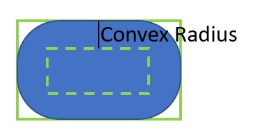

# Architecture of Jolt Physics

For demos and videos go to the [Samples](Samples.md) section.

## Bodies

We use a pretty traditional physics engine setup. We have rigid bodies ([Body](@ref Body)) that have attached collision volumes ([Shape](@ref Shape)). Bodies can either be static (not simulating), dynamic (moved by forces) or kinematic (moved by velocities only). Each moving body has a [MotionProperties](@ref MotionProperties) object that contains information about the movement of the object. Static bodies do not have this to save space (but they can be configured to have it if a static body needs to become dynamic during its lifetime by setting [BodyCreationSettings::mAllowDynamicOrKinematic](@ref BodyCreationSettings::mAllowDynamicOrKinematic)).

Bodies are inserted into the [PhysicsSystem](@ref PhysicsSystem) and interacted with through the [BodyInterface](@ref BodyInterface). Jolt is designed to be accessed from multiple threads so the body interface comes in two flavors: A locking and a non-locking variant. The locking variant uses a mutex array (a fixed size array of mutexes, bodies are associated with a mutex through hashing and multiple bodies use the same mutex, see [MutexArray](@ref MutexArray)) to prevent concurrent access to the same body. The non-locking variant doesn't use mutexes, so requires the user to be careful.

In general, body ID's ([BodyID](@ref BodyID)) are used to refer to bodies. You can access a body through the following construct:

	JPH::BodyLockInterface lock_interface = physics_system.GetBodyLockInterface(); // Or GetBodyLockInterfaceNoLock
	JPH::BodyID body_id = ...; // Obtain ID to body

	// Scoped lock
	{
		JPH::BodyLockRead lock(lock_interface, body_id);
		if (lock.Succeeded()) // body_id may no longer be valid
		{
			const JPH::Body &body = lock.GetBody();

			// Do something with body
			...
		}
	}

When another thread has removed the body between the time the body ID was obtained and the lock, the lock will fail. While the lock is taken, other threads cannot modify the body, so it is safe to work with it. Each body ID contains a sequence number, so body ID's will only be reused after many add/remove cycles. To write to a body use [BodyLockWrite](@ref BodyLockWrite).

You cannot use BodyLockRead to lock multiple bodies (if two threads lock the same bodies in opposite order you'll get a deadlock). Use [BodyLockMultiRead](@ref BodyLockMultiRead) or [BodyLockMultiWrite](@ref BodyLockMultiWrite) to lock them in a consistent order.

Note that a lot of convenience functions are exposed through the BodyInterface, but not all functionality is available, so you may need to lock the body to get the pointer and then call the function directly on the body.

## Body Pointers vs Body ID's

If you're only accessing the physics system from a single thread, you can use Body pointers instead of BodyID's. In this case you can also use the non-locking variant of the body interface.

Note that there are still some restrictions:

* You cannot read from / write to bodies or constraints while PhysicsSystem::Update is running. As soon as the Update starts, all body / constraint mutexes are locked.
* Collision callbacks (see ContactListener) are called from within the PhysicsSystem::Update call from multiple threads. You can only read the body data during a callback.
* Activation callbacks (see BodyActivationListener) are called in the same way. Again you should only read the body during the callback and not make any modifications.
* Step callbacks (see PhysicsStepListener) are also called from PhysicsSystem::Update from multiple threads. You're responsible for making sure that there are no race conditions. In a step listener you can read/write bodies or constraints but you cannot add/remove them.

If you are accessing the physics system from multiple threads, you should probably use BodyID's and the locking variant of the body interface. It is however still possible to use Body pointers if you're really careful. E.g. if there is a clear owner of a Body and you ensure that this owner does not read/write state during PhysicsSystem::Update or while other threads are reading the Body there will not be any race conditions.

## Shapes

Each body has a shape attached that determines the collision volume. The following shapes are available (in order of computational complexity):

* [SphereShape](@ref SphereShape) - A sphere centered around zero.
* [BoxShape](@ref BoxShape) - A box centered around zero.
* [CapsuleShape](@ref CapsuleShape) - A capsule centered around zero.
* [TaperedCapsuleShape](@ref TaperedCapsuleShape) - A capsule with different radii at the bottom and top.
* [CylinderShape](@ref CylinderShape) - A cylinder shape. Note that cylinders are the least stable of all shapes, so use another shape if possible.
* [ConvexHullShape](@ref ConvexHullShape) - A convex hull defined by a set of points.
* [StaticCompoundShape](@ref StaticCompoundShape) - A shape containing other shapes. This shape is constructed once and cannot be changed afterwards. Child shapes are organized in a tree to speed up collision detection.
* [MutableCompoundShape](@ref MutableCompoundShape) - A shape containing other shapes. This shape can be constructed/changed at runtime and trades construction time for runtime performance. Child shapes are organized in a list to make modification easy.
* [MeshShape](@ref MeshShape) - A shape consisting of triangles. They are mostly used for static geometry but can be used for dynamic or kinematic objects as long as they don't collide with other mesh shapes or heightfield shapes.
* [HeightFieldShape](@ref HeightFieldShape) - A shape consisting of NxN points that define the height at each point, very suitable for representing hilly terrain. Any body that uses this shape needs to be static.

Next to this there are a number of decorator shapes that change the behavior of their children:

* [ScaledShape](@ref ScaledShape) - This shape can scale a child shape. Note that if a shape is rotated first and then scaled, you can introduce shearing which is not supported by the library.
* [RotatedTranslatedShape](@ref RotatedTranslatedShape) - This shape can rotate and translate a child shape, it can e.g. be used to offset a sphere from the origin.
* [OffsetCenterOfMassShape](@ref OffsetCenterOfMassShape) - This shape does not change its child shape but it does shift the calculated center of mass for that shape. It allows you to e.g. shift the center of mass of a vehicle down to improve its handling.

### Creating Shapes

Simple shapes like spheres and boxes can be constructed immediately by simply new-ing them. Other shapes need to be converted into an optimized format in order to be usable in the physics simulation. The uncooked data is usually stored in a [ShapeSettings](@ref ShapeSettings) object and then converted to cooked format by a [Create](@ref ShapeSettings::Create) function that returns a [Result](@ref Result) object that indicates success or failure and provides the cooked object.

Creating a convex hull for example looks like:

	// Shapes are refcounted and can be shared between bodies
	JPH::Ref<Shape> shape;

	// The ShapeSettings object is only required for building the shape, all information is copied into the Shape class
	{
		// Create an array of vertices
		JPH::Array<JPH::Vec3> vertices = { ... };

		// Create the settings object for a convex hull
		JPH::ConvexHullShapeSettings settings(vertices, JPH::cDefaultConvexRadius);

		// Create shape
		JPH::Shape::ShapeResult result = settings.Create();
		if (result.IsValid())
			shape = result.Get();
		else
			... // Error handling
	}

Note that after you call Create, the shape is cached and ShapeSettings keeps a reference to your shape. If you call Create again, the same shape will be returned regardless of what changed to the settings object.

### Saving Shapes

There are two ways of serializing data:

* The uncooked data can be serialized using the [ObjectStream](@ref ObjectStream) system (either in [binary](@ref ObjectStreamBinaryOut) or in [text](@ref ObjectStreamTextOut) format), data stored in this way is likely to be compatible with future versions of the library (although there is no 100% guarantee of this).
* The cooked data can be serialized using the [SaveBinaryState](@ref Shape::SaveBinaryState) interface that various objects provide. Data stored in this way is optimized for simulation performance and loading speed but is very likely to change between versions of the library, so this should never be your primary data format.

An example of saving a shape in binary format:

	// Create a sphere of radius 1
	JPH::Ref<Shape> sphere = new JPH::SphereShape(1.0f);

	// For this example we'll be saving the shape in a STL string stream, but if you implement StreamOut you don't have to use STL.
	stringstream data;
	JPH::StreamOutWrapper stream_out(data);

	// Save the shape (note this function handles CompoundShape too).
	// The maps are there to avoid saving the same shape twice (it will assign an ID to each shape the first time it encounters them).
	// If you don't want certain shapes to be saved, add them to the map and give them an ID.
	// You can save many shapes to the same stream by repeatedly calling SaveWithChildren on different shapes.
	JPH::Shape::ShapeToIDMap shape_to_id;
	JPH::Shape::MaterialToIDMap material_to_id;
	sphere->SaveWithChildren(stream_out, shape_to_id, material_to_id);

	// Wrap the STL stream in a StreamIn
	JPH::StreamInWrapper stream_in(data);

	// Load the shape
	// If you have assigned custom ID's on save, you need to ensure that the shapes exist in this map on restore too.
	JPH::Shape::IDToShapeMap id_to_shape;
	JPH::Shape::IDToMaterialMap id_to_material;
	JPH::Shape::ShapeResult result = JPH::Shape::sRestoreWithChildren(stream_in, id_to_shape, id_to_material);

	JPH::Ref<Shape> restored_shape;
	if (result.IsValid())
		restored_shape = result.Get();
	else
		... // Error handling

As the library does not offer an exporter from content creation packages and since most games will have their own content pipeline, we encourage you to store data in your own format, cook data while cooking the game data and store the result using the SaveBinaryState interface (and provide a way to force a re-cook when the library is updated).

### Convex Radius

In order to speed up the collision detection system, all convex shapes use a convex radius. The provided shape will first be shrunken by the convex radius and then inflated again by the same amount, resulting in a rounded off shape:

||
|:-|
|*In this example a box (green) was created with a fairly large convex radius. The shape is shrunken first (dashed green line) and then inflated again equally on all sides. The resulting shape as seen by the collision detection system is shown in blue. A larger convex radius results in better performance but a less accurate simulation. A convex radius of 0 is allowed.*|

### Center of Mass

__Beware: When a shape is created, it will automatically recenter itself around its center of mass.__ The center of mass can be obtained by calling [Shape::GetCenterOfMass](@ref Shape::GetCenterOfMass) and most functions operate in this Center of Mass (COM) space. Some functions work in the original space the shape was created in, they usually have World Space (WS) or Shape Space (SS) in their name (or documentation).


As an example, say we create a box and then translate it:

	// Create box of 2x2x2 m (you specify half the side)
	JPH::BoxShapeSettings box(JPH::Vec3(1, 1, 1));
	JPH::Ref<Shape> box_shape = box.Create().Get();

	// Offset it by 10 m
	JPH::RotatedTranslatedShapeSettings translated_box(JPH::Vec3(10, 0, 0), JPH::Quat::sIdentity(), box_shape);
	JPH::Ref<Shape> translated_box_shape = translated_box.Create().Get();

	// Cast a ray against the offset box (WRONG!)
	JPH::RayCast ray;
	ray.mOrigin = JPH::Vec3(10, 2, 0);
	ray.mDirection = JPH::Vec3(0, -2, 0);

	// Cast ray
	JPH::RayCastResult hit;
	bool had_hit = translated_box_shape->CastRay(ray, JPH::SubShapeIDCreator(), hit);
	JPH_ASSERT(!had_hit); // There's no hit because we did not correct for COM!

	// Convert the ray to center of mass space for the shape (CORRECT!)
	ray.mOrigin -= translated_box_shape->GetCenterOfMass();

	// Cast ray
	had_hit = translated_box_shape->CastRay(ray, JPH::SubShapeIDCreator(), hit);
	JPH_ASSERT(had_hit); // Ray was in COM space, now there's a hit!

In the same way calling:

	translated_box_shape->GetLocalBounds();

will return a box of size 2x2x2 centered around the origin, so in order to get it back to the space in which it was originally created you need to offset the bounding box:

	JPH::AABox shape_bounds = translated_box_shape->GetLocalBounds();
	shape_bounds.Translate(translated_box_shape->GetCenterOfMass());
	JPH_ASSERT(shape_bounds == JPH::AABox(JPH::Vec3(9, -1, -1), JPH::Vec3(11, 1, 1))); // Now we have the box relative to how we created it

Note that when you work with interface of [BroadPhaseQuery](@ref BroadPhaseQuery), [NarrowPhaseQuery](@ref NarrowPhaseQuery) or [TransformedShape](@ref TransformedShape) this transformation is done for you.

## Creating Custom Shapes

If the defined Shape classes are not sufficient, or if your application can make a more efficient implementation because it has specific domain knowledge, it is possible to create a custom collision shape:

* Derive a new class from Shape (e.g. MyShape). If your shape is convex you can consider deriving from ConvexShape, if it contains multiple sub shapes you can derive from CompoundShape or if it wraps a single other shape it can be derived from DecoratedShape.
* Create a settings class that configures your shape (e.g. MyShapeSettings) and inherit it from the corresponding settings class (e.g. ShapeSettings, CompoundShapeSettings or DecoratedShapeSettings).
* Override the ```MyShapeSettings::Create``` function to construct an instance of MyShape.
* If you want to serialize the settings class, register it with the factory: ```Factory::sInstance->Register(RTTI_OF(MyShapeSettings))```
* If you inherited from Shape you need to select a shape type, use e.g. ```EShapeType::User1```
* In all cases you will need to specify a sub shape type, use e.g. ```EShapeSubType::User1```
* If you inherited from ConvexShape you can also specify a convex sub shape type, e.g. ```EShapeSubType::UserConvex1```, in which case you don't need to implement or register the collision detection functions mentioned below.
* Implement the virtual functions that your selected base class exposes. Some functions could be implemented as a dummy if you don't care about the functionality, e.g. if you don't care about buoyancy then GetSubmergedVolume does not need to be implemented.
* Create a ```MyShape::sRegister()``` function to register all collision functions, make sure you call this function after calling ```RegisterTypes()```, see [MeshShape::sRegister](@ref MeshShape::sRegister) for an example.
* Now write collision detection functions to test collision with all other shape types that this shape could collide with and register them with [CollisionDispatch::sRegisterCollideShape](@ref CollisionDispatch::sRegisterCollideShape) and [CollisionDispatch::sRegisterCastShape](@ref CollisionDispatch::sRegisterCastShape). This can be a lot of work, but there are some helper functions that you can use to reduce the work:
 * If you have implemented a collision test for type A vs B then you can register [CollisionDispatch::sReversedCastShape](@ref CollisionDispatch::sReversedCastShape) and [CollisionDispatch::sReversedCollideShape](@ref CollisionDispatch::sReversedCollideShape) for B vs A.
 * If your shape is triangle based, you can forward the testing of a shape vs a single triangle to the [CollideConvexVsTriangles](@ref CollideConvexVsTriangles) and [CastConvexVsTriangles](@ref CastConvexVsTriangles) classes.
 * If your shape contains sub shapes and you have determined that the shape intersects with one of the sub shapes you can forward the sub shape to the collision dispatch again through [CollisionDispatch::sCollideShapeVsShape](@ref CollisionDispatch::sCollideShapeVsShape) and [CollisionDispatch::sCastShapeVsShapeLocalSpace](@ref CollisionDispatch::sCastShapeVsShapeLocalSpace).

## Sensors

Sensors are normal rigid bodies that report contacts with other Dynamic or Kinematic bodies through the [ContactListener](@ref ContactListener) interface. Any detected penetrations will however not be resolved. Sensors can be used to implement triggers that detect when an object enters their area.

The cheapest sensor has a Static motion type. This type of sensor will only detect active bodies entering their area. As soon as a body goes to sleep, the contact will be lost. Note that you can still move a Static sensor around using [BodyInterface::SetPosition](@ref BodyInterface::SetPosition).

When you make a sensor Kinematic or Dynamic and activate it, it will also detect collisions with sleeping bodies, albeit with a higher run-time cost.

To create a sensor, either set [BodyCreationSettings::mIsSensor](@ref BodyCreationSettings::mIsSensor) to true when constructing a body or set it after construction through [Body::SetIsSensor](@ref Body::SetIsSensor). A sensor can only use the discrete motion quality type at this moment.

To make sensors detect collisions with static objects, set the [BodyCreationSettings::mSensorDetectsStatic](@ref BodyCreationSettings::mSensorDetectsStatic) to true or call [Body::SetSensorDetectsStatic](@ref Body::SetSensorDetectsStatic). Note that it can place a large burden on the collision detection system if you have a large sensor intersect with e.g. a large mesh terrain or a height field as you will get many contact callbacks and these contacts will take up a lot of space in the contact cache. Ensure that your sensor is in an object layer that collides with as few static bodies as possible.

## Constraints

Bodies can be connected to each other using constraints ([Constraint](@ref Constraint)).

The following constraints are available:

* [FixedConstraint](@ref FixedConstraintSettings) - Will attach a body to another without any degrees of freedom.
* [DistanceConstraint](@ref DistanceConstraintSettings) - Will attach two bodies with a stick (removing 1 degree of freedom).
* [PointConstraint](@ref PointConstraintSettings) - Will attach two bodies in a single point (removing 3 degrees of freedom)
* [HingeConstraint](@ref HingeConstraintSettings) - Will attach two bodies through a hinge.
* [ConeConstraint](@ref ConeConstraintSettings) - Attaches two bodies in a point and will limit the rotation within a cone.
* [SliderConstraint](@ref SliderConstraintSettings) - Attaches two bodies and allows only movement in a single translation axis (also known as prismatic constraint).
* [SwingTwistConstraint](@ref SwingTwistConstraintSettings) - Attaches two bodies using a point constraint and a swing-twist constraint which approximates the shoulder joint of a human.
* [SixDOFConstraint](@ref SixDOFConstraintSettings) - The most configurable joint allows specifying per translation axis and rotation axis what the limits are.
* [PathConstraint](@ref PathConstraintSettings) - This constraint allows attaching two bodies connected through a Hermite spline path.
* [GearConstraint](@ref GearConstraintSettings) - This constraint connects to two hinge joints and constrains them to connect two gears.
* [RackAndPinionConstraint](@ref RackAndPinionConstraintSettings) - This constraint connects a hinge and a slider constraint to connect a rack and pinion.
* [PulleyConstraint](@ref PulleyConstraintSettings) - This constraint connects two bodies through two fixed points creating something that behaves like two bodies connected through a rope.
* [VehicleConstraint](@ref VehicleConstraintSettings) - This constraint adds virtual wheels or tracks to a body and allows it to behave as a vehicle.

If you want to constrain a dynamic object to the unmovable 'world' you can use [Body::sFixedToWorld](@ref Body::sFixedToWorld) instead of creating a static body.

Bodies do not keep track of the constraints that are connected to them. This means that you're responsible for removing any constraints attached to a body before removing the body from the PhysicsSystem.

Adding and removing constraints can be done from multiple threads, but the constraints themselves do not have any protection against concurrent access. We assume that constraints are owned by some object (e.g. a Ragdoll) and that object ensures that it only modifies its own constraints and contains its own synchronization logic. Constraints can be freely modified except during the physics simulation step.

Contact constraints (when bodies collide) are not handled through the [Constraint](@ref Constraint) class but through the [ContactConstraintManager](@ref ContactConstraintManager) which is considered an internal class.

## Constraint Motors

Most of the constraints support motors (see [MotorSettings](@ref MotorSettings)) which allow you to apply forces/torques on two constrained bodies to drive them to a relative position/orientation. There are two types of motors:
* Linear motors: These motors drive the relative position between two bodies. A linear motor would, for example, slide a body along a straight line when you use a slider constraint.
* Angular motors: These motors drive the relative rotation between two bodies. An example is a hinge constraint. The motor drives the rotation along the hinge axis.

Motors can have three states (see [EMotorState](@ref EMotorState) or e.g. SliderConstraint::SetMotorState):
* Off: The motor is not doing any work.
* Velocity: This type of motor drives the relative velocity between bodies. For a slider constraint, you would push the bodies towards/away from each other with constant velocity. For a hinge constraint, you would rotate the bodies relative to each other with constant velocity. Set the target velocity through e.g. SliderConstraint::SetTargetVelocity / HingeConstraint::SetTargetAngularVelocity.
* Position: This type of motor drives the relative position between bodies. For a slider constraint, you can specify the relative distance you want to achieve between the bodies. For a hinge constraint you can specify the relative angle you want to achieve between the bodies. Set the target position through e.g. SliderConstraint::SetTargetPosition / HingeConstraint::SetTargetAngle.

Motors apply a force (when driving position) or torque (when driving angle) every simulation step to achieve the desired velocity or position. You can control the maximum force/torque that the motor can apply through MotorSettings::mMinForceLimit, MotorSettings::mMaxForceLimit, MotorSettings::mMinTorqueLimit and MotorSettings::mMaxTorqueLimit. Note that if a motor is driving to a position, the torque limits are not used. If a constraint is driving to an angle, the force limits are not used.

Usually the limits are symmetric, so you would set -mMinForceLimit = mMaxForceLimit. This way the motor can push at an equal rate as it can pull. If you would set the range to e.g. [0, FLT_MAX] then the motor would only be able to push in the positive direction. The units for the force limits are Newtons and the values can get pretty big. If your motor doesn't seem to do anything, chances are that you have set the value too low. Since Force = Mass * Acceleration you can calculate the approximate force that a motor would need to supply in order to be effective. Usually the range is set to [-FLT_MAX, FLT_MAX] which lets the motor achieve its target as fast as possible.

For an angular motor, the units are Newton Meters. The formula is Torque = Inertia * Angular Accelaration. Inertia of a solid sphere is 2/5 * Mass * Radius^2. You can use this to get a sense of the amount of torque needed to get the angular acceleration you want. Again, you'd usually set the range to [-FLT_MAX, FLT_MAX] to not limit the motor.

When settings the force or torque limits to [-FLT_MAX, FLT_MAX] a velocity motor will accelerate the bodies to the desired relative velocity in a single time step (if no other forces act on those bodies).

Position motors have two additional parameters: Frequency (MotorSettings::mSpringSettings.mFrequency, Hz) and damping (MotorSettings::mSpringSettings.mDamping, no units). They are implemented as described in [Soft Contraints: Reinventing The Spring - Erin Catto - GDC 2011](https://box2d.org/files/ErinCatto_SoftConstraints_GDC2011.pdf).

You can see a position motor as a spring between the target position and the rigid body. The force applied to reach the target is linear with the distance between current position and target position. When there is no damping, the position motor will cause the rigid body to oscillate around its target.

||
|:-|
|*A rigid body on a slider constraint. The body starts at 1 and is driven to 0 with a position motor. Two different motor frequencies are shown. The higher the frequency, the faster the motor will reach its target, but without damping it will overshoot and oscillate forever.*|

Valid frequencies are in the range (0, 0.5 * simulation frequency]. A frequency of 0 results in no force being applied, a frequency larger than half of the physics simulation frequency will result in instability. For a 60 Hz physics simulation, 20 is a good value for a stiff spring (without damping it will reach its target in 1/(4 * 20) = 0.0125 s), 2 is good for a soft spring (will reach its target in 1/(4 * 2) = 0.125 s).

In order to prevent the motor from overshooting its target, we use damping.

||
|:-|
|*A rigid body on a slider constraint. The body starts at 1 and is driven to 0 with a position motor. The frequency of the motor is 2 Hz and the lines correspond to different damping values.*|

Sensible values for damping are [0, 1] but higher values are also possible. When the damping is below 1, the body will still oscillate around its target, but that oscillation will die out. When the damping is 1 (called critical damping) there is no oscillation at all but it will take longer for the motor to reach its target. When damping is bigger than 1, the system is over dampened. There will not be any oscillation, but it will take even longer for the motor to reach its target.

Because Jolt Physics uses a Symplectic Euler integrator, there will still be a small amount of damping when damping is 0, so you cannot get infinite oscillation (allowing this would make it very likely for the system to become unstable).

## Breakable Constraints

Constraints can be turned on / off by calling Constraint::SetEnabled. After every simulation step, check the total 'lambda' applied on each constraint and disable the constraint if the value goes over a certain threshold. Use e.g. SliderConstraint::GetTotalLambdaPosition / HingeConstraint::GetTotalLambdaRotation. You can see 'lambda' as the linear/angular impulse applied at the constraint in the last physics step to keep the constraint together.

## Soft Bodies

Soft bodies (also known as deformable bodies) can be used to create e.g. a soft ball or a piece of cloth. They are created in a very similar way to normal rigid bodies:

* First allocate a new SoftBodySharedSettings object on the heap. This object will contain the initial positions of all particles and the constraints between the particles. This object can be shared between multiple soft bodies and should remain constant during its lifetime.
* Then create a SoftBodyCreationSettings object (e.g. on the stack) and fill in the desired properties of the soft body.
* Finally construct the body and add it to the world through BodyInterface::CreateAndAddSoftBody.

Soft bodies use the Body class just like rigid bodies but can be identified by checking Body::IsSoftBody. To get to the soft body state, cast the result of Body::GetMotionProperties to SoftBodyMotionProperties and use its API.

Soft bodies try to implement as much as possible of the normal Body interface, but this interface provides a simplified version of reality, e.g. Body::GetLinearVelocity will return the average particle speed and Body::GetPosition returns the average particle position. During simulation, a soft body will never update its rotation. Internally it stores particle velocities in local space, so if you rotate a soft body e.g. by calling BodyInterface::SetRotation, the body will rotate but its velocity will as well.

Soft bodies are currently in development, please note the following:

* Soft bodies can only collide with rigid bodies, collisions between soft bodies are not implemented yet.
* ContactListener callbacks are not triggered for soft bodies.
* AddForce/AddTorque/SetLinearVelocity/SetLinearVelocityClamped/SetAngularVelocity/SetAngularVelocityClamped/AddImpulse/AddAngularImpulse have no effect on soft bodies as the velocity is stored per particle rather than per body.
* Buoyancy calculations have not been implemented yet.
* Constraints cannot operate on soft bodies, set the inverse mass of a particle to zero and move it by setting a velocity to constrain a soft body to something else.
* When calculating friction / restitution an empty SubShapeID will be passed to the ContactConstraintManager::CombineFunction because this is called once per body pair rather than once per sub shape as is common for rigid bodies.

## Broad Phase

When bodies are added to the PhysicsSystem, they are inserted in the broad phase ([BroadPhaseQuadTree](@ref BroadPhaseQuadTree)). This provides quick coarse collision detection based on the axis aligned bounding box (AABB) of a body.

The broad phase is divided in layers, each layer has a AABB quad tree associated with it. When constructing the physics system an [ObjectVsBroadPhaseLayerFilter](@ref ObjectVsBroadPhaseLayerFilter) and [ObjectLayerPairFilter](@ref ObjectLayerPairFilter) need to be provided. These determine which object layers collide with which other layer. If two layers don't collide, the objects inside those layers cannot collide. A standard setup would be to have a MOVING and a NON_MOVING layer, where NON_MOVING doesn't collide with NON_MOVING and all other permutations collide. This ensures that all static bodies are in one tree (which is infrequently updated) and all dynamic bodies are in another (which is updated every simulation step). It is possible to create more layers like a BULLET layer for high detail collision bodies that are attached to lower detail simulation bodies, the MOVING layer would not collide with the BULLET layer, but when performing e.g. weapon collision queries you can filter for only objects in the BULLET layer.

Since we want to access bodies concurrently the broad phase has special behavior. When a body moves, all nodes in the AABB tree from root to the node where the body resides will be expanded using a lock-free approach. This way multiple threads can move bodies at the same time without requiring a lock on the broad phase. Nodes that have been expanded are marked and during the next physics step a new tight-fitting tree will be built in the background while the physics step is running. This new tree will replace the old tree before the end of the simulation step. This is possible since no bodies can be added/removed during the physics step.

When doing a query against the broad phase ([BroadPhaseQuery](@ref BroadPhaseQuery)), you generally will get a body ID for intersecting objects. If a collision query takes a long time to process the resulting bodies (e.g. across multiple simulation steps), you can safely keep using the body ID's as specified in the "Bodies" section.

## Narrow Phase

A narrow phase query ([NarrowPhaseQuery](@ref NarrowPhaseQuery)) will first query the broad phase for intersecting bodies and will under the protection of a body lock construct a transformed shape ([TransformedShape](@ref TransformedShape)) object. This object contains the transform, a reference counted shape and a body ID. Since the shape will not be deleted until you destroy the TransformedShape object, it is a consistent snapshot of the collision information of the body. This ensures that the body is only locked for a short time frame and makes it possible to do the bulk of the collision detection work outside the protection of a lock.

For very long running jobs (e.g. navigation mesh creation) it is possible to query all transformed shapes in an area and then do the processing work using a long running thread without requiring additional locks (see [NarrowPhaseQuery::CollectTransformedShapes](@ref NarrowPhaseQuery::CollectTransformedShapes)).

The narrow phase queries are all handled through the [GJK](@ref GJKClosestPoint) and [EPA](@ref EPAPenetrationDepth) algorithms.

## Collision filtering

As touched upon in the Broad Phase section, there are various collision filtering functions:

* Broadphase layer: Each broad phase layer will result in it's own quad tree so you should not have too many of them. See the Broad Phase section for examples. See [ObjectVsBroadPhaseLayerFilter](@ref ObjectVsBroadPhaseLayerFilter).
* Object layer: An object layer maps to one or more broadphase layers to test against, this allows you to very quickly discard large amounts of bodies. See [ObjectLayerPairFilter](@ref ObjectLayerPairFilter) (used for simulation) and [ObjectLayerFilter](@ref ObjectLayerFilter) (used for collision queries).
* Group filter: Most expensive filtering (bounding boxes already overlap), used only during simulation. Allows you fine tune collision e.g. by discarding collisions between bodies connected by a constraint. See [GroupFilter](@ref GroupFilter) and implementation for ragdolls [GroupFilterTable](@ref GroupFilterTable).
* Body filter: This filter is used instead of the group filter if you do collision queries like CastRay. See [BodyFilter](@ref BodyFilter).
* Shape filter: This filter is used only during collision queries and can be used to filter out individual (sub)shapes. See [ShapeFilter](@ref ShapeFilter).

The filter functions are listed in the order they're called. To avoid work, try to filter out collisions as early as possible.

## The Simulation Step

The simulation step [PhysicsSystem::Update](@ref PhysicsSystem::Update) uses jobs ([JobSystem](@ref JobSystem)) to perform the needed work. This allows spreading the workload across multiple CPU's. We use a Sequential Impulse solver with warm starting as described in [Modeling and Solving Constraints - Erin Catto](https://box2d.org/files/ErinCatto_ModelingAndSolvingConstraints_GDC2009.pdf)

Each physics step can be divided into multiple collision steps. So if you run the simulation at 60 Hz with 2 collision steps we run:

* Collision (1/120s)
* Integration (1/120s)
* Collision (1/120s)
* Integration (1/120s)

In general, the system is stable when running at 60 Hz with 1 collision step.

## Conventions and limits

Jolt Physics uses a right handed coordinate system with Y-up. It is easy to use another axis as up axis by changing the gravity vector using [PhysicsSystem::SetGravity](@ref PhysicsSystem::SetGravity). Some shapes like the [HeightFieldShape](@ref HeightFieldShapeSettings) will need an additional [RotatedTranslatedShape](@ref RotatedTranslatedShapeSettings) to rotate it to the new up axis and vehicles ([VehicleConstraint](@ref VehicleConstraintSettings)) and characters ([CharacterBaseSettings](@ref CharacterBaseSettings)) will need their new up-axis specified too.

We use column-major vectors and matrices, this means that to transform a point you need to multiply it on the right hand side: TransformedPoint = Matrix * Point.

Note that the physics simulation works best if you use SI units (meters, radians, seconds, kg). In order for the simluation to be accurate, dynamic objects should be in the order [0.1, 10] meters long and have speeds in the order of [0, 500] m/s. Static object should be in the order [0.1, 2000] meter long. If you are using different units, consider scaling the objects before passing them on to the physics simulation.

## Big Worlds

By default the library compiles using floats. This means that the simulation gets less accurate the further you go from the origin. If all simulation takes place within roughly 5 km from the origin, floating point precision is accurate enough.

If you have a bigger world, you may want to compile the library using the JPH_DOUBLE_PRECISION define. When you do this, all positions will be stored as doubles, which will make the simulation accurate even at thousands of kilometers away from the origin.

Calculations with doubles are much slower than calculations with floats. A naive implementation that changes all calculations to doubles has been measured to run more than 2x slower than the same calculations using floats. Because of this, Jolt Physics will only use doubles where necessary and drop down to floats as soon as possible. In order to do this, many of the collision query functions will need a 'base offset'. All collision results will be returned as floats relative to this base offset. By choosing the base offset wisely (i.e. close to where collision results are expected) the results will be accurate. Make sure your base offset is not kilometers away from the collision result.

Keep in mind that:

* There are a lot of 'epsilons' in the code that have been tuned for objects of sizes/speeds as described in the previous section. Try to keep the individual objects to the specified scale even if they're really far from the origin.
* When the collision results of a single query are kilometers apart, precision will suffer as they will be far away from the 'base offset'.
* The effectiveness of the broad phase (which works in floats) will become less at large distances from the origin, e.g. at 10000 km from the origin, the resolution of the broad phase is reduced to 1 m which means that everything that's closer than 1 m will be considered colliding. This will not impact the quality of the simulation but it will result in extra collision tests in the narrow phase so will hurt performance.

Because of the minimal use of doubles, the simulation runs 5-10% slower in double precision mode compared to float precision mode.

## Continuous Collision Detection

Each body has a motion quality setting ([EMotionQuality](@ref EMotionQuality)). By default the motion quality is [Discrete](@ref Discrete). This means that at the beginning of each simulation step we will perform collision detection and if no collision is found, the body is free to move according to its velocity. This usually works fine for big or slow moving objects. Fast and small objects can easily 'tunnel' through thin objects because they can completely move through them in a single time step. For these objects there is the motion quality [LinearCast](@ref LinearCast). Objects that have this motion quality setting will do the same collision detection at the beginning of the simulation step, but once their new position is known, they will do an additional CastShape to check for any collisions that may have been missed. If this is the case, the object is placed back to where the collision occurred and will remain there until the next time step. This is called 'time stealing' and has the disadvantage that an object may appear to move much slower for a single time step and then speed up again. The alternative, back stepping the entire simulation, is computationally heavy so was not implemented.

||
|:-|
|*With the Discrete motion quality the blue object tunnels through the green object in a single time step. With motion quality LinearCast it doesn't.*|

Fast rotating long objects are also to be avoided, as the LinearCast motion quality will fully rotate the object at the beginning of the time step and from that orientation perform the CastShape, there is a chance that the object misses a collision because it rotated through it.

||
|:-|
|*Even with the LinearCast motion quality the blue object rotates through the green object in a single time step.*|

## Deterministic Simulation

The physics simulation is deterministic provided that:

* The APIs that modify the simulation are called in exactly the same order. For example, bodies and constraints need to be added/removed/modified in exactly the same order so that the state at the beginning of a simulation step is exactly the same for both simulations.
* The same binary code is used to run the simulation. For example, when you run the simulation on Windows it doesn't matter if you have an AMD or Intel processor.

If you want cross platform determinism then please turn on the CROSS_PLATFORM_DETERMINISTIC option in CMake. This will make the library approximately 8% slower but the simulation will be deterministic regardless of:

* Compiler used to compile the library (tested MSVC2022 vs clang)
* Configuration (Debug, Release or Distribution)
* OS (tested Windows, macOS, Linux)
* Architecture (x86 or ARM).

Some caveats:

* The same source code must be used to compile the library on all platforms.
* The source code must be compiled with the same defines, e.g. you can't have one platform using JPH_DOUBLE_PRECISION and another not.

It is quite difficult to verify cross platform determinism, so this feature is less tested than other features. With every build, the following architectures are verified to produce the same results:

* Windows MSVC x86 64-bit with AVX2
* Windows MSVC x86 32-bit with SSE2
* macOS clang x86 64-bit with AVX
* Linux clang x86 64-bit with AVX2
* Linux clang ARM 64-bit with NEON

The most important things to look out for in your own application:

* Compile your application mode in Precise mode (clang: -ffp-model=precise, MSVC: /fp:precise)
* Turn off floating point contract operations (clang: -ffp-contract=off)
* Do not use the standard trigonometry functions (sin, cos etc.) as they have different implementations on different platforms, use Jolt's functions (Sin, Cos etc.)
* Do not use std::sort as it has a different implementation on different platforms, use Jolt's QuickSort function

When running the Samples Application you can press ESC, Physics Settings and check the 'Check Determinism' checkbox. Before every simulation step we will record the state using the [StateRecorder](@ref StateRecorder) interface, rewind the simulation and do the step again to validate that the simulation runs deterministically. Some of the tests (e.g. the MultiThreaded) test will explicitly disable the check because they randomly add/remove bodies from different threads. This violates the rule that the API calls must be done in the same order so will not result in a deterministic simulation.

## Rolling Back a Simulation

When synchronizing two simulations via a network, it is possible that a change that needed to be applied at frame N is received at frame N + M. This will require rolling back the simulation to the state of frame N and repeating the simulation with the new inputs. This can be implemented by saving the physics state using [SaveState](@ref PhysicsSystem::SaveState) at every frame. To roll back, call [RestoreState](@ref PhysicsSystem::RestoreState) with the state at frame N. SaveState only records the state that the physics engine modifies during its update step (positions, velocities etc.), so if you change anything else you need to restore this yourself. E.g. if you did a [SetFriction](@ref Body::SetFriction) on frame N + 2 then, when rewinding, you need to restore the friction to what is was on frame N and update it again on frame N + 2 when you replay. If you start adding/removing objects (e.g. bodies or constraints) during these frames, the RestoreState function will not work. If you added a body on frame N + 1, you'll need to remove it when rewinding and then add it back on frame N + 1 again (with the proper initial position/velocity etc. because it won't be contained in the snapshot at frame N).

If you wish to share saved state between server and client, you need to ensure that all APIs that modify the state of the world are called in the exact same order. So if the client creates physics objects for player 1 then 2 and the server creates the objects for 2 then 1 you already have a problem (the body IDs will be different, which will render the save state snapshots incompatible). When rolling back a simulation, you'll also need to ensure that the BodyIDs are kept the same, so you need to remove/add the body from/to the physics system instead of destroy/re-create them or you need to create bodies with the same ID on both sides using [BodyInterface::CreateBodyWithID](@ref BodyInterface::CreateBodyWithID).

## Working With Multiple Physics Systems

You can create, simulate and interact with multiple PhysicsSystems at the same time provided that you do not share any objects (bodies, constraints) between the systems.
When a Body is created it receives a BodyID that is unique for the PhysicsSystem that it was created for, so it cannot be shared. The only object that can be shared between PhysicsSystems is a Shape.
If you want to move a body from one PhysicsSystem to another, use Body::GetBodyCreationSettings to get the settings needed to create the body in the other PhysicsSystem.

PhysicsSystems are not completely independent:

* There is only 1 RTTI factory (Factory::sInstance).
* There is only 1 default material (PhysicsMaterial::sDefault).
* There is only 1 debug renderer (DebugRenderer::sInstance) although many functions take a custom DebugRenderer for drawing.
* Custom shapes and CollisionDispatch functions are shared.
* The custom memory allocation functions (e.g. Allocate), Trace and AssertFailed functions are shared.

These functions / systems need to be registered in advance.

## The Simulation Step in Detail

The job graph looks like this:


Note that each job indicates if it reads/writes positions/velocities and if it deactivates/activates bodies. We do not allow jobs to read/write the same data concurrently. The arrows indicate the order in which jobs are executed. Yellow blocks mean that there are multiple jobs of this type. Dotted arrows have special meaning and are explained below.

### Broad Phase Update Prepare

This job will refit the AABBs of the broad phase. It does this by building a new tree while keeping the old one available as described in the "Broad Phase" section.

### Broad Phase Update Finalize

This job will simply swap the new tree with the old tree. The old tree will be discarded at the beginning of the next PhysicsSystem::Update call so that any broad phase query can continue to run.

### Step Listeners

You can register one or more step listeners (See [PhysicsSystem::AddStepListener](@ref PhysicsSystem::AddStepListener)). This job will call [PhysicsStepListener::OnStep](@ref PhysicsStepListener::OnStep) for every listener. This can be used to do work that needs to be done at the beginning of each step, e.g. set velocities on ragdoll bodies.

### Apply Gravity

A number of these jobs run in parallel. Each job takes a batch of active bodies and applies gravity and damping (updating linear and angular velocity).

### Determine Active Constraints

This job will go through all non-contact constraints and determine which constraints are active based on if the bodies that the constraint connects to are active.

### Build Islands from Constraints

This job will go through all non-contact constraints and assign the involved bodies and constraint to the same island. Since we allow concurrent insertion/removal of bodies we do not want to keep island data across multiple simulation steps, so we recreate the islands from scratch every simulation step. The operation is lock-free and O(N) where N is the number of constraints.

If a constraint connects an active and a non-active body, the non-active body is woken up. One find collisions job will not start until this job has finished in order to pick up any collision testing for newly activated bodies.

### Find Collisions

This job will do broad and narrow phase checks. Initially a number of jobs are started based on the amount of active bodies. The job will do the following:

- Take a batch of active bodies and collide them against the broadphase.
- When a collision pair is found it is inserted in a lock free queue to be processed later.
- If the queue is full, it will be processed immediately (more Find Collisions jobs are spawned if not all CPU cores are occupied yet as the queue starts to fill up).
- If there are no more active bodies to process, the job will start to perform narrow phase collision detection and set up contact constraints if any collisions are found.
- As soon as a narrow phase pair is processed it will recheck if there are new active bodies to be processed (active bodies can be generated by an active body colliding with an inactive body) and if so process them.
- When there are no more active bodies to test and no more collision pairs to be processed the job terminates.

Note that this job cannot start until apply gravity is done because the velocity needs to be known for elastic collisions to be calculated properly.

The contact points between the two bodies will be determined by the [GJK](@ref GJKClosestPoint) and [EPA](@ref EPAPenetrationDepth) algorithms. For each contact point we will calculate the face that belongs to that contact point. The faces of both bodies are clipped against each other ([ManifoldBetweenTwoFaces](@ref ManifoldBetweenTwoFaces)) so that we have a polygon (or point / line) that represents the contact between the two bodies (contact manifold).

Multiple contact manifolds with similar normals are merged together (PhysicsSystem::ProcessBodyPair::ReductionCollideShapeCollector). After this the contact constraints are created in the [ContactConstraintManager](@ref ContactConstraintManager) and their Jacobians / effective masses calculated.

Contacting bodies are also linked together to form islands. This is the same operation as described in the "Build Islands From Constraints" section.

The narrow phase makes use of a lock free contact cache. We have 2 caches, one that is used for reading (which contains the contacts from the previous step) and one for writing new contact pairs. When a contact point is preserved from the last simulation step, it will be copied from the read cache to the write cache.

### Setup Velocity Constraints

This job will go through all non-contact constraints and prepare them for execution. This involves calculating Jacobians and effective masses for each constraint part.

### Finalize Islands

This job will finalize the building of the simulation islands. Each island contains bodies that interact with each other through a contact point or through a constraint. These islands will be simulated separately in different jobs later. The finalization of the islands is an O(N) operation where N is the amount of active bodies (see [IslandBuilder::Finalize](@ref IslandBuilder::Finalize)).

### Set Body Island Idx

This job does some housekeeping work that can be executed concurrent to the solver:

* It will assign the island ID to all bodies (which is mainly used for debugging purposes)

### Solve Velocity Constraints

A number of these jobs will run in parallel. Each job takes the next unprocessed island and will run the iterative constraint solver for that island. It will first apply the impulses applied from the previous simulation step (which are stored in the contact cache) to warm start the solver. It will then repeatedly iterate over all contact and non-contact constraints until either the applied impulses are too small or a max iteration count is reached ([PhysicsSettings::mNumVelocitySteps](@ref PhysicsSettings::mNumVelocitySteps)). The result will be that the new velocities are known for all active bodies. The applied impulses are stored in the contact cache for the next step.

When an island consists of more than LargeIslandSplitter::cLargeIslandTreshold contacts plus constraints it is considered a large island. In order to not do all work on a single thread, this island will be split up by the LargeIslandSplitter. This follows an algorithm described in High-Performance Physical Simulations on Next-Generation Architecture with Many Cores by Chen et al. This is basically a greedy algorithm that tries to group contacts and constraints into groups where no contact or constraint affects the same body. Within a group, the order of execution does not matter since every memory location is only read/written once, so we can parallelize the update. At the end of each group, we need to synchronize the CPU cores before starting on the next group. When the number of groups becomes too large, a final group is created that contains all other contacts and constraints and these are solved on a single thread. The groups are processed PhysicsSettings::mNumVelocitySteps times so the end result is almost the same as an island that was not split up (only the evalutation order changes in a consistent way).

### Pre Integrate

This job prepares the CCD buffers.

### Integrate & Clamp Velocities

This job will integrate the velocity and update the position. It will clamp the velocity to the max velocity.

Depending on the motion quality ([EMotionQuality](@ref EMotionQuality)) of the body, it will schedule a body for continuous collision detection (CCD) if its movement is bigger than some treshold based on the [inner radius](@ref Shape::GetInnerRadius)) of the shape.

### Post Integrate

Find CCD Contact jobs are created on the fly depending on how many CCD bodies were found. If there are no CCD bodies it will immediately start Resolve CCD Contacts.

### Find CCD Contacts

A number of jobs wil run in parallel and pick up bodies that have been scheduled for CCD and will do a linear cast to detect the first collision. It always allows movement of the object by a fraction if its inner radius in order to prevent it from getting fully stuck.

### Resolve CCD Contacts

This job will take the collision results from the previous job and update position and velocity of the involved bodies. If an object hits another object, its time will be 'stolen' (it will move less far than it should according to its velocity).

### Finalize Contact Cache, Contact Removed Callbacks

This job will:

* Swap the read/write contact cache and prepare the contact cache for the next step.
* It will detect all contacts that existed previous step and do not exist anymore to fire callbacks for them through the [ContactListener](@ref ContactListener) interface.

### Solve Position Constraints, Update Bodies Broad Phase

A number of these jobs will run in parallel. Each job takes the next unprocessed island and run the position based constraint solver. This fixes numerical drift that may have caused constrained bodies to separate (remember that the constraints are solved in the velocity domain, so errors get introduced when doing a linear integration step). It will run until either the applied position corrections are too small or until the max amount of iterations is reached ([PhysicsSettings::mNumPositionSteps](@ref PhysicsSettings::mNumPositionSteps)). Here there is also support for large islands, the island splits that were calculated in the Solve Velocity Constraints job are reused to solve partial islands in the same way as before.

It will also notify the broad phase of the new body positions / AABBs.

When objects move too little the body will be put to sleep. This is detected by taking the biggest two axis of the local space bounding box of the shape together with the center of mass of the shape (all points in world space) and keep track of 3 bounding spheres for those points over time. If the bounding spheres become too big, the bounding spheres are reset and the timer restarted. When the timer reaches a certain time, the object has is considered non-moving and is put to sleep.

### Soft Body Prepare

If there are any active soft bodies, this job will create the Soft Body Collide, Simulate and Finalize Jobs. It will also create a list of sorted SoftBodyUpdateContext objects that forms the context for those jobs.

### Soft Body Collide

These jobs will do broadphase checks for all of the soft bodies. A thread picks up a single soft body and uses the bounding box of the soft body to find intersecting rigid bodies. Once found, information will be collected about that rigid body so that Simulate can run in parallel.

### Soft Body Simulate

These jobs will do the actual simulation of the soft bodies. They first collide batches of soft body vertices with the rigid bodies found during during the Collide job (multiple threads can work on a single soft body) and then perform the simulation using XPBD (also partially distributing a single soft body on multiple threads).

### Soft Body Finalize

This job writes back all the rigid body velocity changes and updates the positions and velocities of the soft bodies. It can activate/deactivate bodies as needed.